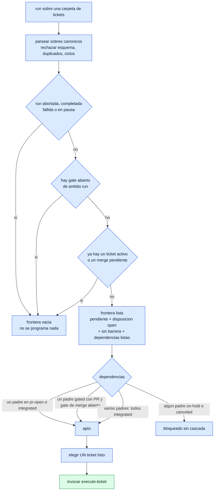
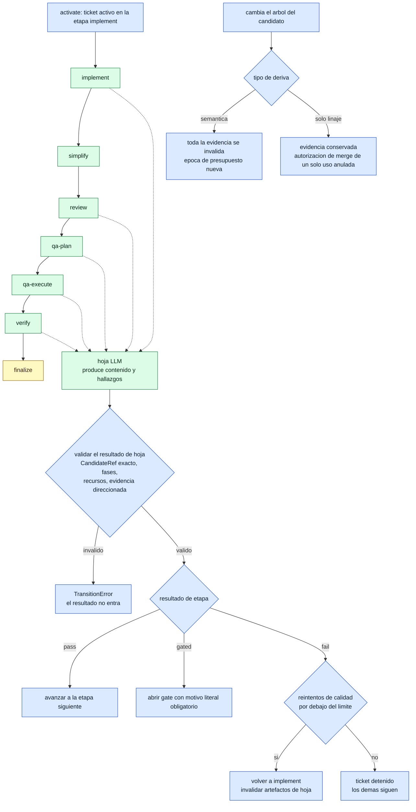
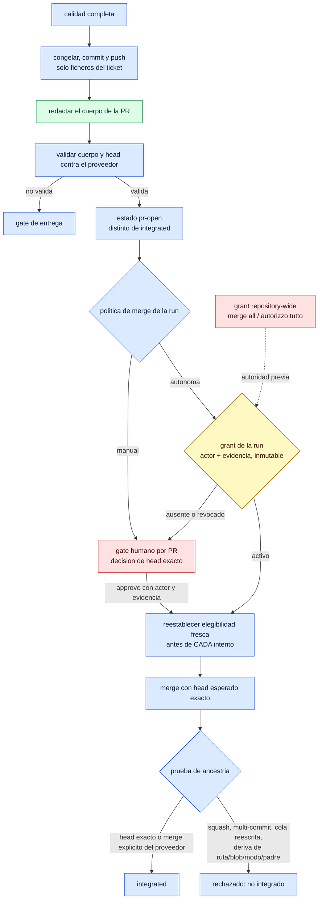
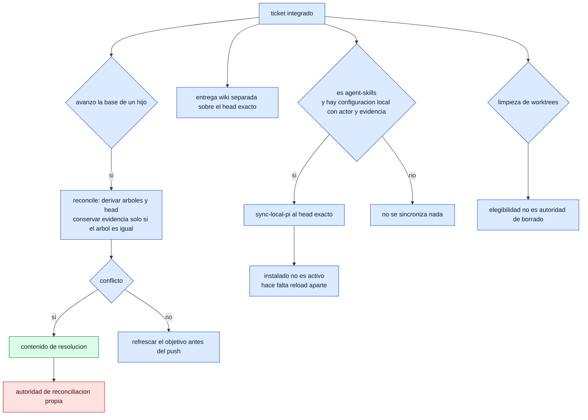
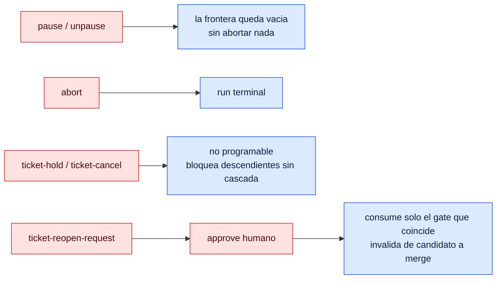

# El árbol decisional de Autopilot

## Artifact Graph
- Artifact ID: `artifact:autopilot-decision-tree`
- Role: `spec`
- Standalone: true

### Children
- [ADT-01](../tickets/autopilot-decision-tree/01-chart-the-decisions.md)

## Type
Documentación de arquitectura

## Status
Active

## Qué es esto

El flujo entero de Autopilot dibujado, con **cada elección marcada por quién la toma**:

| Color | Quién decide | Qué significa |
|---|---|---|
| 🟦 azul | **programática** | código determinista; mismos datos, misma rama, siempre |
| 🟩 verde | **LLM** | un modelo produce contenido o juicio |
| 🟥 rojo | **humana** | requiere actor y evidencia durables; nadie la infiere |
| 🟨 amarillo | **híbrida** | el LLM propone, el código valida, o el humano autoriza y el código ejecuta |

Todos los anclajes son al SHA exacto `0f6abbf06543c46cdfe0d865ff3b97f304dfeb91` y están
comprobados por máquina: el fichero y la línea deben contener el símbolo citado.

## 1. El lazo del scheduler

Todo el lazo es **programático**: `ready_ids` devuelve lista vacía ante run terminal, gate de
ámbito run, pausa, ticket activo o merge pendiente, y `_dependency_ready` decide por estado y
disposición, nunca por juicio. Un gate HITL de un ticket **no** congela los demás.

## 2. El ciclo de un ticket

Las siete etapas son literales en el código: `implement, simplify, review, qa-plan, qa-execute,
verify, finalize`. El LLM hace el trabajo de las etapas, pero **su salida solo entra por un
validador**: `validate_leaf_result` exige CandidateRef exacto, fases, recursos y evidencia
direccionada por contenido; un `pass` sin candidato o un `fail` sin hallazgos es un error de
transición, no una etapa aprobada.

## 3. Entrega, autoridad y merge

`approve_gate` exige actor y evidencia no vacíos, y el gate de verificación post-merge solo se
resuelve con su recibo canónico de auditoría: ni el agente ni el runner pueden firmarlo.
`grant_autonomous_merge` es **inmutable** y está atado a run, repositorio, proveedor y digest del
conjunto de tickets; repetirlo idéntico es idempotente, cambiarlo es un error.

## 4. Después de integrar

## 5. Controles que cortan el árbol en cualquier punto

## 6. Dónde vive cada decisión

Anclajes al SHA `0f6abbf06543c46cdfe0d865ff3b97f304dfeb91`, comprobados por máquina.

| # | Decisión | Quién | Anclaje | Prueba |
|---|---|---|---|---|
| D1 | frontera lista de la run | programática | `kernel.py:949 ready_ids` | `test_kernel.py`, `test_gate_readiness.py` |
| D2 | dependencias de un ticket | programática | `kernel.py:927 _dependency_ready` | **sin test por nombre**; se ejercita vía D1 |
| D3 | hold/cancel bloquea descendientes | programática | `kernel.py:982 _administrative_dependency_causes` | **sin test por nombre** |
| D4 | avance, fallo o gate de etapa | programática | `kernel.py:1468 record_stage` | 12 ficheros de test |
| D5 | un gate exige motivo literal | programática | `kernel.py:164 stage_gate_reason` | vía D4 |
| D6 | admisión del resultado de hoja | programática sobre salida LLM | `leaf_protocol.py:578 validate_leaf_result` | `test_leaf_protocol.py` |
| D7 | admisión de recursos y presupuesto | programática | `leaf_protocol.py:360 _admit_resources` | **sin test por nombre** |
| D8 | deriva de candidato invalida evidencia | programática | `kernel.py:1305 invalidate_for_candidate_drift` | 5 ficheros de test |
| D9 | elegibilidad docs-only | programática | `kernel.py:1208 complete_docs_only_candidate` | `test_kernel.py` |
| D10 | candidato apto para merge autónomo | programática | `kernel.py:1066 autonomous_merge_candidate_ready` | **sin test por nombre** |
| D11 | qué PR toca mergear ahora | programática | `kernel.py:1029 pending_runner_merge_id` | vía `test_kernel.py` |
| D12 | prueba de ancestría de la integración | programática | `kernel.py:3490 record_integration` | 5 ficheros de test |
| D13 | adopción de un head externo equivalente | programática | `kernel.py:3316 adopt_equivalent_external_head` | `test_kernel.py` |
| D14 | estado de la run | programática | `kernel.py:4285 _update_run_state` | **sin test por nombre** |
| H1 | aprobación de un gate | humana | `kernel.py:1892 approve_gate` | 5 ficheros de test |
| H2 | grant de merge autónomo de la run | humana | `kernel.py:4155 grant_autonomous_merge` | `test_kernel.py`, `test_cli.py` |
| H3 | autoridad de merge de todo el repositorio | humana | `repository_merge_authority.py:42 RepositoryMergeAuthorityStore` | vía `test_cli.py` |
| H4 | grant de proyección de completitud | humana | `kernel.py:3943 grant_completion_projection` | `test_kernel.py`, `test_ticket_sources.py` |
| H5 | reapertura solicitada y aprobada | humana | `kernel.py:1836 request_reopen` | `test_kernel.py`, `test_status_transaction.py` |
| H6 | cambio de disposición | humana | `kernel.py:3796 record_disposition_transition` | `test_kernel.py` |
| H7 | pausa de la run | humana | `kernel.py:4223 pause_run` | 4 ficheros de test |
| L1 | contenido de implementación y simplificación | LLM | etapas `implement`/`simplify` de `kernel.py:114 STAGES` | entra solo por D6 |
| L2 | hallazgos de review, plan y ejecución de QA, verificación | LLM | etapas `review`/`qa-plan`/`qa-execute`/`verify` | entra solo por D6 |
| L3 | contenido de resolución de conflictos | LLM | `cli.py:1357 _reconciliation_conflict_resolver` | autoridad aparte |
| L4 | cuerpo de la PR | LLM | `pr_body_artifact.py:78 read_pr_body` | validado contra el proveedor |
| Y1 | disposición final de la verificación | híbrida | `verification_contract.py:814 reduce_claims` | evidencia LLM, reducción determinista |
| Y2 | sincronización local tras integrar | híbrida | `pi_sync.py:1143 synchronize_local_pi` | **sin test por nombre**; el módulo tiene `test_pi_sync.py` |
| Y3 | propiedad de la instalación al sincronizar | programática | `pi_sync.py:329 _assert_owned_install` | **sin test por nombre**; falla cerrado ante deriva |

## Lo que este documento no prueba

- **Ninguna traza viva.** El runner está suspendido por petición del usuario y este trabajo es
  skills-only: las ramas se demuestran con código al SHA exacto y con los tests que ya existen,
  no ejecutando una run. No hay aquí ninguna traza de ejecución.
- **Siete decisiones sin ningún test que las nombre**: D2, D3, D7, D10, D14, Y2 e Y3. El
  comprobador de cobertura recorre los 106 ficheros de test del repositorio a ese SHA y no
  encuentra sus símbolos en ninguno. Puede haber cobertura indirecta —el módulo `pi_sync`
  tiene `test_pi_sync.py` y `test_pi_sync_windows.py`, y la frontera se ejercita a través de
  `ready_ids`— pero no se afirma. La primera versión de esta tabla declaraba cuatro; el
  comprobador encontró tres más y se corrigió la tabla, no la afirmación.
- **El diagrama es un mapa, no el territorio.** `kernel.py` tiene 4 772 líneas y `cli.py`
  6 691; aquí están las decisiones que cambian el rumbo del flujo, no todas las ramas.
- **La clasificación es una lectura.** Que una decisión sea programática está probado por el
  código; que sea *la* decisión relevante es juicio, y puede discutirse.
