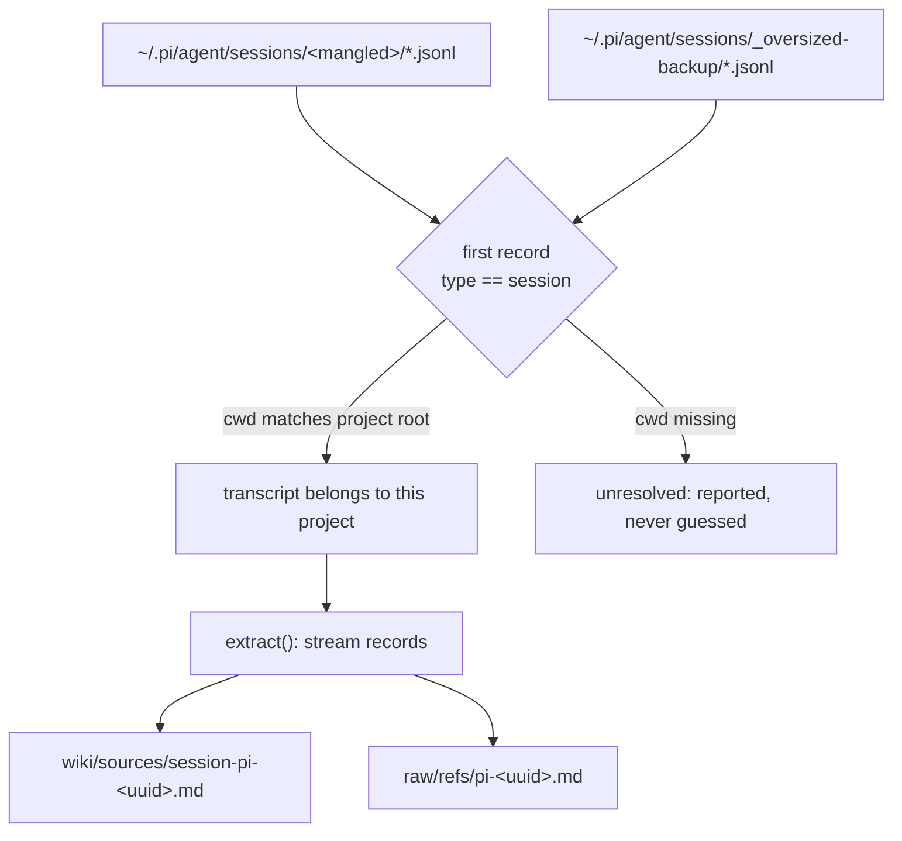

# LLM Wiki Pi session provider

## Artifact Graph
- Artifact ID: `spec:llm-wiki-pi-session-provider`
- Role: `spec`
- Standalone: true

### Children
- [PSP-01 — Read session text from nested message content](../tickets/llm-wiki-pi-session-provider/01-nested-message-content.md)
- [PSP-02 — Compile Pi sessions through binding-declared providers](../tickets/llm-wiki-pi-session-provider/02-pi-provider-dispatch.md)
- [PSP-03 — Bound and document large-transcript ingest](../tickets/llm-wiki-pi-session-provider/03-large-transcript-bound.md)

## Type
Feature

## Status
Drafted from code and from measurements taken on one real project (`ocr-dotnet-api`) on
2026-09-15. Every number below was observed, not estimated; the store layout of Pi is
inferred from that one installation and is the main thing to confirm before building.

## Summary

`llm-wiki` compiles agent sessions into one digest and one pointer per session. It knows
two providers, Claude Code and Codex, and both are hardcoded. Pi — the harness that
produced most of the recent work in at least one bound wiki — is invisible to it.

Adding Pi is not a matter of one more path constant. Three independent layers refuse Pi
today, and only the first is obvious:

1. **discovery** has no Pi root;
2. **text extraction** cannot read a Pi record, so a Pi digest would be empty even if
   discovery found the file;
3. **record-kind vocabulary** uses Codex spellings (`session_meta`, `compacted`) that Pi
   does not emit, so `cwd` and compaction counts would stay unset.

Layer 2 is the reason this spec exists rather than a one-line patch: a Pi adapter that only
fixes discovery would produce six confident, empty, wrong pages.

## Evidence

### The wiki sees none of it

On `C:\Users\CGS03\Projects\ocr-dotnet-api`, ingested 2026-09-15:

| Provider | Transcripts | Bytes | Ingested |
|---|---:|---:|---|
| claude-code | 3 | 30.1 MB | yes |
| codex | 3 | 3.1 MB | yes |
| **pi** | **3** | **577.9 MB** | **no** |

Pi holds ~17× the bytes of both supported providers combined and is the only provider
whose sessions are entirely absent from that project's history.

### Layer 1 — discovery

`llm-wiki/scripts/session_discovery.py` declares exactly two roots:

```python
CLAUDE_ROOT = Path.home() / ".claude" / "projects"
CODEX_ROOT  = Path.home() / ".codex" / "sessions"
```

`llm-wiki-project.json` carries `session_providers`, and `project_binding.py` validates it
as a list of strings — but neither `session_discovery.py` nor `session_ingest.py` ever
reads it. The field is inert: adding `"pi"` to a binding today changes nothing.

Observed Pi store, one installation:

```
~/.pi/agent/sessions/<mangled-project-dir>/<iso-timestamp>_<uuid>.jsonl
~/.pi/agent/sessions/_oversized-backup/<iso-timestamp>_<uuid>.jsonl
```

`C:\Users\CGS03\Projects\ocr-dotnet-api` maps to
`--C--Users-CGS03-Projects-ocr-dotnet-api--`: the Claude mangling wrapped in a leading and
trailing `--`. Unlike Claude, Pi also records identity **inside** the file, in the first
record, so the Codex rule applies too:

```json
{"type":"session","version":3,"id":"01a0a620-…","timestamp":"2026-09-15T17:32:48.668Z",
 "cwd":"C:\\Users\\CGS03\\Projects\\ocr-dotnet-api"}
```

`_oversized-backup/` matters: Pi rotates large transcripts there, and a rotated file loses
its project directory while keeping its `cwd`. The two files observed there (86 MB and
1.86 GB) both resolve to a different project, which is exactly why they must be resolved
rather than assumed.

### Layer 2 — a Pi digest would be empty

`session_ingest.extract()` is provider-agnostic and streams records; it pulls text through
`_text_of(record)`, which probes `text`, `content`, `message`, `summary` and accepts a
`str`, a `list` of `str`/`{"text": …}`, or a `dict` whose `text`/`content` is a `str`.

A Pi message is a dict whose `content` is a **list**, one level deeper than that last case:

```json
{"type":"message","id":"f3f79428","parentId":"170f70bc","timestamp":"…",
 "message":{"role":"user","content":[{"type":"text","text":"…"}],"timestamp":"…"}}
```

Measured on the 174-record session `01a0a620`: **0 records yield any text**. Every Pi
digest would report no files, no decisions and no ticket mentions — indistinguishable from
a session that did nothing.

With a block-aware reader (descend into `message.content[*].text`):

| Session | Records | Extracted text | `docs/…` paths | Records with a decision marker |
|---|---:|---:|---:|---:|
| `01a0a620` (0.2 MB) | 176 | 150,646 chars | 80 | 12 |
| `01a07b1c` (3.7 MB) | 804 | 754,854 chars | 59 | 81 |

### Layer 3 — record-kind vocabulary

`extract()` sets `facts.cwd` only on `type == "session_meta"` and counts compaction only on
`type == "compacted"`. Pi's spellings differ. Observed kinds in the 574 MB transcript:

```
message 2657 · custom_message 15 · compaction 5 · model_change 4 · custom 3
thinking_level_change 2 · session 1
```

### Size

The 574 MB transcript is **2,687 lines**: ~214 KB per record, longest single line 4.9 MB,
12.9 s to stream end to end. Because `extract()` already streams, memory is bounded by the
longest line and not by the file; the cost is time and per-line regex work. The largest
file observed in any Pi store was 1.86 GB, which bounds the worst case to confirm.

## Goals

- Compile Pi sessions into the same digest + pointer pair the other two providers produce.
- Resolve a Pi transcript to a project by the identity the file itself records, so a
  rotated transcript is still attributed correctly.
- Make `session_providers` the real dispatch list, so a wiki states which providers it
  compiles instead of inheriting whatever the script hardcodes.
- Extract text from Pi records with the same fidelity the other providers get, and prove
  it with a count rather than an assumption.
- Keep a large transcript a reported fact, not a silent truncation or a crash.

## Non-goals

- Copying transcripts into `raw/`. The pointer contract is unchanged.
- Asserting a session's claims as project truth; the attribution wording stays.
- Widening `TICKET_REFERENCE` (`\b([A-Z]{2,6}-\d{2,4})\b`). Projects whose tickets are
  named `01` or `M02` get zero ticket mentions from **every** provider today; that is a
  separate, provider-independent decision and is deliberately not bundled here.
- Any Pi-side change. Pi's store format is read as found.

## Design

### Provider dispatch

`session_discovery` and `session_ingest` take the provider set from the binding's
`session_providers` and compile exactly those. An unknown provider name is an error naming
the value, not a silent skip — a typo must not look like an empty store. Existing bindings
listing `claude-code` and `codex` keep exactly today's output; Pi is opt-in by adding
`"pi"`, which is also what makes the field honest for the first time.

### Pi adapter



- **Identity** is `cwd` from the first `type: "session"` record, compared the way Codex
  paths are compared. The mangled directory name is a prefilter, never the decision, so
  `_oversized-backup/` needs no special case beyond being scanned.
- **Session id** is the UUID after `_` in `<iso>_<uuid>.jsonl`, matching the `id` field
  that same record carries. A file whose name and `id` disagree is unresolved, not
  silently preferred one way.
- **Kind vocabulary** maps per provider: Pi's `session` carries `cwd`, Pi's `compaction`
  is the compaction counter.

### Text extraction

`_text_of` descends one further level: a `dict` whose `content` is a `list` is walked like
the top-level list case already is, collecting `str` items and `{"text": …}` blocks.
Non-text blocks stay undecoded, exactly as attachments do today. This is provider-neutral
and should leave Claude and Codex digests byte-identical — which is a test, not a claim.

## Semantic invariants

- A transcript is attributed to a project only by an identity the file or its store
  records; a transcript with no resolvable `cwd` is reported as unresolved and ingested
  nowhere.
- A digest never states a session's claims as project truth.
- Re-running with no new records writes nothing.
- A page's `record_count`, `size_bytes` and `last_record_timestamp` describe the exact
  bytes read.
- A provider named in the binding but absent from the machine reports an empty store; a
  provider *not* named is not compiled and is not reported as empty.

## Failure modes

| Failure | Required behavior |
|---|---|
| Pi store absent | report zero transcripts for `pi`, not an error |
| Transcript with no `type: "session"` record | unresolved; named in output, ingested nowhere |
| Filename UUID ≠ in-file `id` | unresolved and named; no silent preference |
| Line that is not JSON | skipped, as today, and counted |
| Transcript grows between digest and lint | `stale-session-pointer` fires, as today |
| Multi-GB transcript | completes, or fails with the size it refused; never truncates silently |
| Unknown provider in binding | error naming the value |

## Alternatives considered

- **Directory-name mangling as identity**, like Claude. Rejected: it cannot attribute a
  rotated transcript in `_oversized-backup/`, and the file already carries the answer.
- **A generic "any JSONL" provider.** Rejected: identity and record vocabulary are exactly
  what differs between providers, so the generic version would guess at both.
- **Skipping transcripts above a size cap.** Rejected as the default: a cap that drops the
  largest session silently deletes the most history. Refusing loudly with the size is
  acceptable; skipping quietly is not.

## Implementation slices

1. Dispatch on `session_providers` in discovery and ingest, with an error for an unknown
   name. Claude and Codex output unchanged.
2. Block-aware `_text_of`, with a regression test asserting Claude and Codex digests are
   unchanged and a Pi fixture now yields text.
3. Pi discovery: both directories, `cwd`-based attribution, unresolved reporting.
4. Pi kind mapping (`session` → cwd, `compaction` → counter) and session-id rule.
5. Large-transcript behavior: measured, and documented in the pointer text.
6. Skill documentation: provider table, the binding field's new meaning, and how to opt in.

## Verification strategy

- **Unit**: mangling and `cwd` matching on Windows and POSIX paths; `_text_of` across all
  three record shapes; session-id extraction including the disagreement case.
- **Integration**: fixture stores per provider; assert Claude/Codex digests byte-identical
  before and after; assert a Pi fixture produces digest + pointer with non-zero extracted
  text; assert an unresolved transcript is reported and not ingested.
- **System**: re-ingest of the real `ocr-dotnet-api` wiki; `lint_wiki.py` clean; second run
  writes nothing.
- **Live/manual**: one run against the 574 MB transcript, recording wall time and peak
  memory. Not simulated.

## Acceptance outcomes

- A wiki whose binding lists `pi` compiles one digest and one pointer per Pi transcript
  belonging to its project, including rotated ones.
- The Pi digests carry a non-zero extracted-text count; the measured baseline for
  `01a0a620` is 80 `docs/…` paths where today it is 0.
- Claude and Codex digests are byte-identical to their pre-change output.
- A binding that does not list `pi` compiles no Pi session.
- `lint_wiki.py` reports no new errors or warnings on the re-ingested wiki.

## Open questions

- **Q1** — Is `~/.pi/agent/sessions` the only store, or can it be relocated by
  configuration? Observed on one machine; confirm before hardcoding the root.
- **Q2** — Is the `--…--` wrapper on the directory name stable across Pi versions and
  POSIX hosts? The design only uses it as a prefilter, which limits the blast radius, but
  the answer decides whether it is worth using at all.
- **Q3** — Should `custom_message` and `custom` records contribute text? They are 18 of
  2,687 records in the measured transcript and their payload shape was not inspected.
- **Q4** — What is the acceptable wall time for a full re-ingest? 12.9 s for one 574 MB
  transcript is fine; a store with ten is a different conversation.
