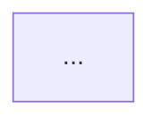

# Explain PR

Turn a pull request into a clear explanation that a technically curious 15-year-old can understand without losing the evidence a reviewer needs.

## Inputs

Accept any of:

- A GitHub PR URL or number.
- The PR associated with the current branch.
- A branch diff that will become a PR.
- Optional ticket, spec, issue, or acceptance-criteria context.

If the target is ambiguous, ask one concise question. When invoked by `ticket-autopilot`, use the PR it just opened and do not ask.

## Evidence collection

Inspect before writing:

1. The PR diff or branch diff against its base.
2. Commit messages and changed files.
3. The source ticket/spec and acceptance criteria when available.
4. Tests, builds, lint, QA evidence, and review findings from the current workflow.
5. Relevant code around changed public boundaries when the diff alone is insufficient.

Do not infer behavior from filenames alone. Do not claim a test passed without evidence.

## Writing standard

Write for a bright 15-year-old:

- Use short sentences and ordinary words.
- Explain unavoidable jargon the first time it appears.
- Describe observable behavior before implementation details.
- Use one brief analogy only when it genuinely clarifies the change.
- Stay respectful and precise; simple must not become childish.

Keep reviewer-grade details in dedicated sections. Never hide risks, skipped tests, migrations, breaking changes, or uncertainty.

## Required PR body

Produce Markdown with these sections in this order:

```markdown
## What changed

<2-5 plain-language bullets describing the result.>

## Why

<Problem and intended outcome in plain language.>

## Before and after

**Before:** <How the relevant behavior or flow worked.>

**After:** <How it works now.>



## Code map

- `<path or component>` — <what changed and what it now does>

## How it works

<Short step-by-step explanation of the new flow.>

## Verification

- ✅ `<command or QA step>` — <result>
- ⚠️ `<skipped or unavailable check>` — <reason>

## Risks and limits

- <Known risk, compatibility concern, rollout note, or `None identified`.>

## Reviewer checklist

- [ ] <Most important behavior to verify>
- [ ] <Second important behavior or regression surface>
```

## Diagram rules

Include exactly one useful Mermaid diagram in every PR body.

- Prefer `flowchart LR` for request, data, or component flow.
- Use a state diagram only when state transitions are the change.
- Show the relevant before/after difference, not the entire system.
- Label nodes with plain language.
- Keep it small enough to understand at a glance, normally 4-10 nodes.
- Use syntax supported by GitHub Mermaid rendering.
- If architecture did not change, diagram the changed behavior or decision path instead of inventing new components.
- Cross-check every node and edge against the diff and surrounding code.

## Create or update the PR

When a PR already exists and the user or invoking workflow authorized external mutation:

1. Resolve the PR with `gh pr view`.
2. Preserve important human-written context that is not contradicted by the diff.
3. Replace stale generated explanation sections rather than appending duplicates.
4. Update the body with `gh pr edit`.
5. Read the PR back and verify that all required headings and the Mermaid block are present.

When no PR exists:

- If branch, remote, base, and title are known and PR creation is authorized, create the PR with this body.
- Otherwise return the complete Markdown body for the caller to use. Do not invent a PR number or claim an update occurred.

## Failure handling

- If the diff is empty, stop and report that there is nothing to explain.
- If the PR contains multiple unrelated changes, explain the groups separately and flag the scope problem under risks.
- If Mermaid cannot accurately represent the change, use a minimal behavioral flow and state the limitation in the prose.
- If GitHub access fails, return the generated Markdown and the exact blocker; never report that the PR was updated.

## Final response

Report only:

- PR link or generated-body location.
- Whether the GitHub body was created or updated.
- Any missing evidence, skipped verification, or blocker.
