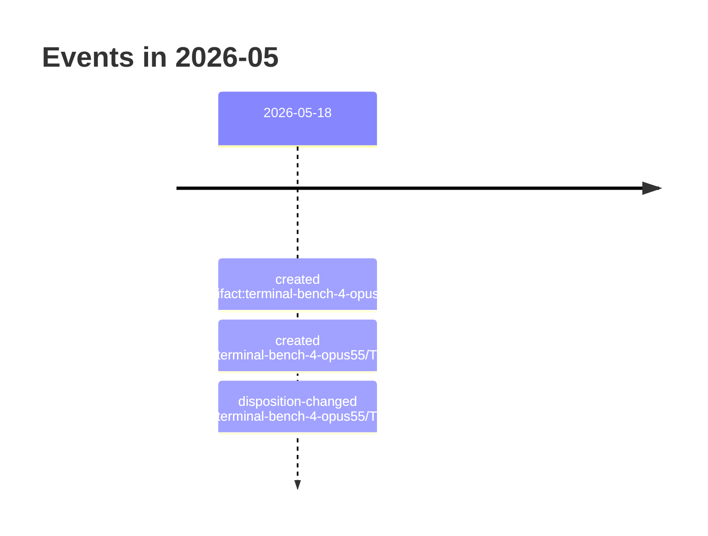

# 2026-05

3 dated event(s). Every date carries the rung that produced it; a date
the resolver could not establish is absent from this page rather than guessed onto it.

## Events

- `2026-05-18` — created of Terminal-Bench 4.0 — pilota Harbor standard e confronto locale separato (`artifact:terminal-bench-4-opus55`), from a commit touching the file
- `2026-05-18` — created of TBF-03 — Ejecutar tres intentos Harbor estándar (`ticket:terminal-bench-4-opus55/TBF-03`), from a commit touching the file
- `2026-05-18` — disposition-changed of TBF-03 — Ejecutar tres intentos Harbor estándar (`ticket:terminal-bench-4-opus55/TBF-03`), from a rename recorded in Git
