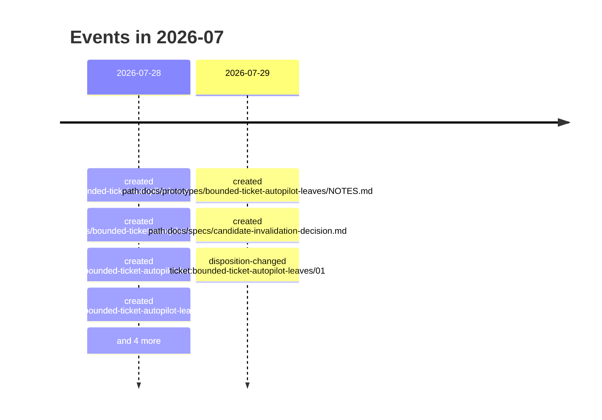

# 2026-07

11 dated event(s). Every date carries the rung that produced it; a date
the resolver could not establish is absent from this page rather than guessed onto it.

## Events

- `2026-07-28` — created of Bounded Ticket-Autopilot Leaves (`artifact:bounded-ticket-autopilot-leaves-wayfinder`), from a commit touching the file
- `2026-07-28` — created of Bounded Ticket-Autopilot Leaf Protocol (`path:docs/specs/bounded-ticket-autopilot-leaf-protocol.md`), from a commit touching the file
- `2026-07-28` — created of Prototype bounded leaf accounting and resumable handoffs (`ticket:bounded-ticket-autopilot-leaves/01`), from a commit touching the file
- `2026-07-28` — created of Implement budgets and a bounded review handoff (`ticket:bounded-ticket-autopilot-leaves/02`), from a commit touching the file
- `2026-07-28` — created of Checkpoint QA and deterministic verification (`ticket:bounded-ticket-autopilot-leaves/03`), from a commit touching the file
- `2026-07-28` — created of Drive delivery to a terminal result in one request (`ticket:bounded-ticket-autopilot-leaves/04`), from a commit touching the file
- `2026-07-28` — created of Cache immutable context and evidence for an unchanged CandidateRef (`ticket:bounded-ticket-autopilot-leaves/05`), from a commit touching the file
- `2026-07-28` — created of Decide whether evidence may survive CandidateRef changes (`ticket:bounded-ticket-autopilot-leaves/06`), from a commit touching the file
- `2026-07-29` — created of Bounded Ticket-Autopilot Leaves Prototype (`path:docs/prototypes/bounded-ticket-autopilot-leaves/NOTES.md`), from a commit touching the file
- `2026-07-29` — created of Candidate invalidation decision (`path:docs/specs/candidate-invalidation-decision.md`), from a commit touching the file
- `2026-07-29` — disposition-changed of Prototype bounded leaf accounting and resumable handoffs (`ticket:bounded-ticket-autopilot-leaves/01`), from a rename recorded in Git
