# 2026-08

222 dated event(s). Every date carries the rung that produced it; a date
the resolver could not establish is absent from this page rather than guessed onto it.

```mermaid
timeline
    title Events in 2026-08
    2026-08-01 : created path:docs/specs/ticket-autopilot-delivery-merge-wayfinder.md : created ticket:ticket-autopilot-delivery-merge/01 : disposition-changed ticket:ticket-autopilot-delivery-merge/01 : created ticket:ticket-autopilot-delivery-merge/02 : and 3 more
    2026-08-05 : created artifact:ticket-autopilot-ignored-ticket-sources : created path:docs/specs/ticket-autopilot-autonomous-stacked-delivery.md : created ticket:ticket-autopilot-delivery-merge/04 : disposition-changed ticket:ticket-autopilot-delivery-merge/04 : and 4 more
    2026-08-06 : disposition-changed ticket:ticket-autopilot-delivery-merge/06 : disposition-changed ticket:ticket-autopilot-delivery-merge/07
    2026-08-08 : created artifact:artifact-graph-decision : created artifact:open-github-issues-wayfinder : created path:docs/research/mattpocock-skills-parity.md : created path:docs/specs/ticket-lifecycle-disposition-decision.md : and 9 more
    2026-08-09 : disposition-changed ticket:mattpocock-skills-adoption/U-01 : disposition-changed ticket:mattpocock-skills-adoption/U-02 : disposition-changed ticket:mattpocock-skills-adoption/U-03 : disposition-changed ticket:mattpocock-skills-adoption/U-04 : and 5 more
    2026-08-11 : created artifact:autopilot-context-budget-unit-decision : created artifact:autopilot-token-economics-wayfinder : created artifact:cross-host-context-rollover-decision : created artifact:cross-host-context-rollover-wayfinder : and 28 more
    2026-08-12 : created artifact:windows-text-fidelity-wayfinder : created path:docs/prototypes/cross-host-context-rollover/NOTES.md : disposition-changed ticket:bounded-ticket-autopilot-leaves/07 : disposition-changed ticket:cross-host-context-rollover/CR-02 : and 8 more
    2026-08-13 : disposition-changed ticket:windows-text-fidelity/WT-01 : disposition-changed ticket:windows-text-fidelity/WT-02 : disposition-changed ticket:windows-text-fidelity/WT-03 : disposition-changed ticket:windows-text-fidelity/WT-07
    2026-08-26 : created artifact:artifact-graph-disposition-drift-diagnostic : created artifact:artifact-link-integrity-wayfinder : created artifact:llm-wiki-app-compatibility : created artifact:llm-wiki-app-independence-decision : and 44 more
    2026-08-28 : created artifact:cross-host-context-compaction-controls : created artifact:llm-wiki-docs-only-autosync-contract : created artifact:llm-wiki-docs-only-autosync-decision : created artifact:llm-wiki-docs-only-autosync-prototype : and 26 more
    2026-08-29 : created artifact:cross-host-context-rollover-live-proof : created artifact:cross-host-rollover-codex-version-bound-probe-diagnostic : created artifact:llm-wiki-agent-skills-ingest : created artifact:llm-wiki-docs-only-autosync-forward-test : and 53 more
```

## Events

- `2026-08-01` — created of Ticket Autopilot Delivery, Merge, and Open-Issue Recovery (`path:docs/specs/ticket-autopilot-delivery-merge-wayfinder.md`), from a commit touching the file
- `2026-08-01` — created of Publish and verify the explain-pr body before pr-open (`ticket:ticket-autopilot-delivery-merge/01`), from a commit touching the file
- `2026-08-01` — disposition-changed of Publish and verify the explain-pr body before pr-open (`ticket:ticket-autopilot-delivery-merge/01`), from a rename recorded in Git
- `2026-08-01` — created of Merge immediately after exact-SHA authorization (`ticket:ticket-autopilot-delivery-merge/02`), from a commit touching the file
- `2026-08-01` — disposition-changed of Merge immediately after exact-SHA authorization (`ticket:ticket-autopilot-delivery-merge/02`), from a rename recorded in Git
- `2026-08-01` — created of Reconcile an external merge atomically (`ticket:ticket-autopilot-delivery-merge/03`), from a commit touching the file
- `2026-08-01` — disposition-changed of Reconcile an external merge atomically (`ticket:ticket-autopilot-delivery-merge/03`), from a rename recorded in Git
- `2026-08-05` — created of Ticket Autopilot Ignored Ticket Sources (`artifact:ticket-autopilot-ignored-ticket-sources`), from a commit touching the file
- `2026-08-05` — created of Ticket Autopilot Autonomous Stacked Delivery (`path:docs/specs/ticket-autopilot-autonomous-stacked-delivery.md`), from a commit touching the file
- `2026-08-05` — created of Support Git-ignored ticket sources (`ticket:ticket-autopilot-delivery-merge/04`), from a commit touching the file
- `2026-08-05` — disposition-changed of Support Git-ignored ticket sources (`ticket:ticket-autopilot-delivery-merge/04`), from a rename recorded in Git
- `2026-08-05` — created of Preserve stack evidence across lineage-only rebases (`ticket:ticket-autopilot-delivery-merge/05`), from a commit touching the file
- `2026-08-05` — disposition-changed of Preserve stack evidence across lineage-only rebases (`ticket:ticket-autopilot-delivery-merge/05`), from a rename recorded in Git
- `2026-08-05` — created of Add an opt-in autonomous merge grant (`ticket:ticket-autopilot-delivery-merge/06`), from a commit touching the file
- `2026-08-05` — created of Rewrite the README for ticket-autopilot (`ticket:ticket-autopilot-delivery-merge/07`), from a commit touching the file
- `2026-08-06` — disposition-changed of Add an opt-in autonomous merge grant (`ticket:ticket-autopilot-delivery-merge/06`), from a rename recorded in Git
- `2026-08-06` — disposition-changed of Rewrite the README for ticket-autopilot (`ticket:ticket-autopilot-delivery-merge/07`), from a rename recorded in Git
- `2026-08-08` — created of Canonical artifact graph decision (`artifact:artifact-graph-decision`), from a commit touching the file
- `2026-08-08` — created of Open GitHub Issues Remediation (`artifact:open-github-issues-wayfinder`), from a commit touching the file
- `2026-08-08` — created of Matt Pocock skills parity (`path:docs/research/mattpocock-skills-parity.md`), from a commit touching the file
- `2026-08-08` — created of Ticket lifecycle and disposition decision (`path:docs/specs/ticket-lifecycle-disposition-decision.md`), from a commit touching the file
- `2026-08-08` — created of Redact diagnostic evidence (`ticket:mattpocock-skills-adoption/U-01`), from a commit touching the file
- `2026-08-08` — created of Adopt the shared codebase-design reference (`ticket:mattpocock-skills-adoption/U-02`), from a commit touching the file
- `2026-08-08` — created of Align TDD seam and test guidance (`ticket:mattpocock-skills-adoption/U-03`), from a commit touching the file
- `2026-08-08` — created of Scope architecture improvement with shared design vocabulary (`ticket:mattpocock-skills-adoption/U-04`), from a commit touching the file
- `2026-08-08` — created of Adopt writing-for-agents (`ticket:mattpocock-skills-adoption/U-05`), from a commit touching the file
- `2026-08-08` — created of Adopt redacted temporary session handoff (`ticket:mattpocock-skills-adoption/U-06`), from a commit touching the file
- `2026-08-08` — created of Adopt to-questionnaire with a no-send boundary (`ticket:mattpocock-skills-adoption/U-07`), from a commit touching the file
- `2026-08-08` — created of Add safe intent-based conflict resolution (`ticket:mattpocock-skills-adoption/U-08`), from a commit touching the file
- `2026-08-08` — created of Add a safe human-run wizard template (`ticket:mattpocock-skills-adoption/U-09`), from a commit touching the file
- `2026-08-09` — disposition-changed of Redact diagnostic evidence (`ticket:mattpocock-skills-adoption/U-01`), from a rename recorded in Git
- `2026-08-09` — disposition-changed of Adopt the shared codebase-design reference (`ticket:mattpocock-skills-adoption/U-02`), from a rename recorded in Git
- `2026-08-09` — disposition-changed of Align TDD seam and test guidance (`ticket:mattpocock-skills-adoption/U-03`), from a rename recorded in Git
- `2026-08-09` — disposition-changed of Scope architecture improvement with shared design vocabulary (`ticket:mattpocock-skills-adoption/U-04`), from a rename recorded in Git
- `2026-08-09` — disposition-changed of Adopt writing-for-agents (`ticket:mattpocock-skills-adoption/U-05`), from a rename recorded in Git
- `2026-08-09` — disposition-changed of Adopt redacted temporary session handoff (`ticket:mattpocock-skills-adoption/U-06`), from a rename recorded in Git
- `2026-08-09` — disposition-changed of Adopt to-questionnaire with a no-send boundary (`ticket:mattpocock-skills-adoption/U-07`), from a rename recorded in Git
- `2026-08-09` — disposition-changed of Add safe intent-based conflict resolution (`ticket:mattpocock-skills-adoption/U-08`), from a rename recorded in Git
- `2026-08-09` — disposition-changed of Add a safe human-run wizard template (`ticket:mattpocock-skills-adoption/U-09`), from a rename recorded in Git
- `2026-08-11` — created of Autopilot context budget unit (`artifact:autopilot-context-budget-unit-decision`), from a commit touching the file
- `2026-08-11` — created of Autopilot Token Economics (`artifact:autopilot-token-economics-wayfinder`), from a commit touching the file
- `2026-08-11` — created of Cross-host Context Rollover Policy (`artifact:cross-host-context-rollover-decision`), from a commit touching the file
- `2026-08-11` — created of Cross-host Context Rollover (`artifact:cross-host-context-rollover-wayfinder`), from a commit touching the file
- `2026-08-11` — created of Freeze the context budget unit (`ticket:autopilot-token-economics/TK-01`), from a commit touching the file
- `2026-08-11` — disposition-changed of Freeze the context budget unit (`ticket:autopilot-token-economics/TK-01`), from a rename recorded in Git
- `2026-08-11` — created of Measure the static prompt prefix (`ticket:autopilot-token-economics/TK-02`), from a commit touching the file
- `2026-08-11` — disposition-changed of Measure the static prompt prefix (`ticket:autopilot-token-economics/TK-02`), from a rename recorded in Git
- `2026-08-11` — created of Bound leaf context intake (`ticket:autopilot-token-economics/TK-03`), from a commit touching the file
- `2026-08-11` — disposition-changed of Bound leaf context intake (`ticket:autopilot-token-economics/TK-03`), from a rename recorded in Git
- `2026-08-11` — created of Compose the worst-case per-turn ceiling (`ticket:autopilot-token-economics/TK-04`), from a commit touching the file
- `2026-08-11` — disposition-changed of Compose the worst-case per-turn ceiling (`ticket:autopilot-token-economics/TK-04`), from a rename recorded in Git
- `2026-08-11` — created of Document autopilot dependencies (`ticket:autopilot-token-economics/TK-05`), from a commit touching the file
- `2026-08-11` — created of Write the token-reduction guide (`ticket:autopilot-token-economics/TK-06`), from a commit touching the file
- `2026-08-11` — disposition-changed of Write the token-reduction guide (`ticket:autopilot-token-economics/TK-06`), from a rename recorded in Git
- `2026-08-11` — created of Audit model-invocation exposure (`ticket:autopilot-token-economics/TK-07`), from a commit touching the file
- `2026-08-11` — created of Record the context-passing boundary (`ticket:autopilot-token-economics/TK-08`), from a commit touching the file
- `2026-08-11` — created of Observe live run token consumption (`ticket:autopilot-token-economics/TK-09`), from a commit touching the file
- `2026-08-11` — created of Make ticket source drift detection line-ending consistent (`ticket:autopilot-windows-digest-drift/WD-01`), from a commit touching the file
- `2026-08-11` — created of Decode provider and Git command output as UTF-8 (`ticket:autopilot-windows-digest-drift/WD-02`), from a commit touching the file
- `2026-08-11` — disposition-changed of Implement budgets and a bounded review handoff (`ticket:bounded-ticket-autopilot-leaves/02`), from a rename recorded in Git
- `2026-08-11` — disposition-changed of Checkpoint QA and deterministic verification (`ticket:bounded-ticket-autopilot-leaves/03`), from a rename recorded in Git
- `2026-08-11` — disposition-changed of Drive delivery to a terminal result in one request (`ticket:bounded-ticket-autopilot-leaves/04`), from a rename recorded in Git
- `2026-08-11` — disposition-changed of Cache immutable context and evidence for an unchanged CandidateRef (`ticket:bounded-ticket-autopilot-leaves/05`), from a rename recorded in Git
- `2026-08-11` — created of Add a docs-only fast path to ticket-autopilot (`ticket:bounded-ticket-autopilot-leaves/07`), from a commit touching the file
- `2026-08-11` — created of Freeze the rollover policy (`ticket:cross-host-context-rollover/CR-01`), from a commit touching the file
- `2026-08-11` — disposition-changed of Freeze the rollover policy (`ticket:cross-host-context-rollover/CR-01`), from a rename recorded in Git
- `2026-08-11` — created of Prototype Codex rollover (`ticket:cross-host-context-rollover/CR-02`), from a commit touching the file
- `2026-08-11` — created of Prototype Claude Code rollover (`ticket:cross-host-context-rollover/CR-03`), from a commit touching the file
- `2026-08-11` — created of Prove cross-host rollover live (`ticket:cross-host-context-rollover/CR-04`), from a commit touching the file
- `2026-08-11` — created of Gate ignored-to-tracked source promotion (`ticket:ticket-autopilot-ignored-ticket-sources/IS-01`), from a commit touching the file
- `2026-08-11` — disposition-changed of Gate ignored-to-tracked source promotion (`ticket:ticket-autopilot-ignored-ticket-sources/IS-01`), from a rename recorded in Git
- `2026-08-12` — created of Windows Text Fidelity at the Provider Boundary (`artifact:windows-text-fidelity-wayfinder`), from a commit touching the file
- `2026-08-12` — created of Cross-host Context Rollover Prototypes (`path:docs/prototypes/cross-host-context-rollover/NOTES.md`), from a commit touching the file
- `2026-08-12` — disposition-changed of Add a docs-only fast path to ticket-autopilot (`ticket:bounded-ticket-autopilot-leaves/07`), from a rename recorded in Git
- `2026-08-12` — disposition-changed of Prototype Codex rollover (`ticket:cross-host-context-rollover/CR-02`), from a rename recorded in Git
- `2026-08-12` — disposition-changed of Prototype Claude Code rollover (`ticket:cross-host-context-rollover/CR-03`), from a rename recorded in Git
- `2026-08-12` — created of Make the PR body round trip character-identical through the provider (`ticket:windows-text-fidelity/WT-01`), from a commit touching the file
- `2026-08-12` — created of Decide the decoding `errors` policy for command output (`ticket:windows-text-fidelity/WT-02`), from a commit touching the file
- `2026-08-12` — created of Implement the decided decoding `errors` policy (`ticket:windows-text-fidelity/WT-03`), from a commit touching the file
- `2026-08-12` — created of Add the platform-conditional tests that do not exist (`ticket:windows-text-fidelity/WT-04`), from a commit touching the file
- `2026-08-12` — created of Resolve the deferred `.strip()` equality hazard (`ticket:windows-text-fidelity/WT-05`), from a commit touching the file
- `2026-08-12` — created of Restore a green Windows baseline for the test suite (`ticket:windows-text-fidelity/WT-06`), from a commit touching the file
- `2026-08-12` — created of Decide and introduce continuous integration (`ticket:windows-text-fidelity/WT-07`), from a commit touching the file
- `2026-08-13` — disposition-changed of Make the PR body round trip character-identical through the provider (`ticket:windows-text-fidelity/WT-01`), from a rename recorded in Git
- `2026-08-13` — disposition-changed of Decide the decoding `errors` policy for command output (`ticket:windows-text-fidelity/WT-02`), from a rename recorded in Git
- `2026-08-13` — disposition-changed of Implement the decided decoding `errors` policy (`ticket:windows-text-fidelity/WT-03`), from a rename recorded in Git
- `2026-08-13` — disposition-changed of Decide and introduce continuous integration (`ticket:windows-text-fidelity/WT-07`), from a rename recorded in Git
- `2026-08-26` — created of Artifact Graph Drift Across a Ticket Disposition Move (`artifact:artifact-graph-disposition-drift-diagnostic`), from a commit touching the file
- `2026-08-26` — created of Artifact Link Integrity (`artifact:artifact-link-integrity-wayfinder`), from a commit touching the file
- `2026-08-26` — created of LLM Wiki application compatibility at v0.5.4 (`artifact:llm-wiki-app-compatibility`), from a commit touching the file
- `2026-08-26` — created of LLM Wiki App Independence and the Correction Channel (`artifact:llm-wiki-app-independence-decision`), from a commit touching the file
- `2026-08-26` — created of LLM Wiki as a Project History Knowledge Base (`artifact:llm-wiki-project-history-wayfinder`), from a commit touching the file
- `2026-08-26` — created of LLM Wiki Re-ingest Identity and Change Contract (`artifact:llm-wiki-reingest-identity-decision`), from a commit touching the file
- `2026-08-26` — created of Test suite baseline (`artifact:test-suite-baseline`), from a commit touching the file
- `2026-08-26` — created of Record the test suite baseline (`ticket:artifact-graph-disposition-drift/AG-01`), from a commit touching the file
- `2026-08-26` — disposition-changed of Record the test suite baseline (`ticket:artifact-graph-disposition-drift/AG-01`), from a rename recorded in Git
- `2026-08-26` — created of Classify the vendored llm-wiki skill in the model invocation policy (`ticket:artifact-graph-disposition-drift/AG-02`), from a commit touching the file
- `2026-08-26` — disposition-changed of Classify the vendored llm-wiki skill in the model invocation policy (`ticket:artifact-graph-disposition-drift/AG-02`), from a rename recorded in Git
- `2026-08-26` — created of Resolve artifact links across a ticket disposition move (`ticket:artifact-graph-disposition-drift/AG-03`), from a commit touching the file
- `2026-08-26` — disposition-changed of Resolve artifact links across a ticket disposition move (`ticket:artifact-graph-disposition-drift/AG-03`), from a rename recorded in Git
- `2026-08-26` — created of Normalise the vendored llm-wiki front matter to a single-line description (`ticket:artifact-graph-disposition-drift/AG-04`), from a commit touching the file
- `2026-08-26` — disposition-changed of Normalise the vendored llm-wiki front matter to a single-line description (`ticket:artifact-graph-disposition-drift/AG-04`), from a rename recorded in Git
- `2026-08-26` — created of Align the docs-only gate with the audit it calls (`ticket:artifact-graph-disposition-drift/AG-05`), from a commit touching the file
- `2026-08-26` — disposition-changed of Align the docs-only gate with the audit it calls (`ticket:artifact-graph-disposition-drift/AG-05`), from a rename recorded in Git
- `2026-08-26` — created of Repair the existing disposition drift once (`ticket:artifact-link-integrity/LI-01`), from a commit touching the file
- `2026-08-26` — disposition-changed of Repair the existing disposition drift once (`ticket:artifact-link-integrity/LI-01`), from a rename recorded in Git
- `2026-08-26` — created of Movers repoint inbound links in the same commit (`ticket:artifact-link-integrity/LI-02`), from a commit touching the file
- `2026-08-26` — disposition-changed of Movers repoint inbound links in the same commit (`ticket:artifact-link-integrity/LI-02`), from a rename recorded in Git
- `2026-08-26` — created of Decide AG-05's disposition (`ticket:artifact-link-integrity/LI-03`), from a commit touching the file
- `2026-08-26` — disposition-changed of Decide AG-05's disposition (`ticket:artifact-link-integrity/LI-03`), from a rename recorded in Git
- `2026-08-26` — created of Decide the audit surface for the LLM-Wiki app profile (`ticket:llm-wiki-project-history/LW-01`), from a commit touching the file
- `2026-08-26` — created of Check that the LLM Wiki application still opens the tree (`ticket:llm-wiki-project-history/LW-02`), from a commit touching the file
- `2026-08-26` — disposition-changed of Check that the LLM Wiki application still opens the tree (`ticket:llm-wiki-project-history/LW-02`), from a rename recorded in Git
- `2026-08-26` — created of Bind a wiki instance to its host project (`ticket:llm-wiki-project-history/LW-03`), from a commit touching the file
- `2026-08-26` — disposition-changed of Bind a wiki instance to its host project (`ticket:llm-wiki-project-history/LW-03`), from a rename recorded in Git
- `2026-08-26` — created of Resolve artefact dates through a recorded provenance ladder (`ticket:llm-wiki-project-history/LW-04`), from a commit touching the file
- `2026-08-26` — disposition-changed of Resolve artefact dates through a recorded provenance ladder (`ticket:llm-wiki-project-history/LW-04`), from a rename recorded in Git
- `2026-08-26` — created of Ingest repository docs as wiki source pages (`ticket:llm-wiki-project-history/LW-05`), from a commit touching the file
- `2026-08-26` — disposition-changed of Ingest repository docs as wiki source pages (`ticket:llm-wiki-project-history/LW-05`), from a rename recorded in Git
- `2026-08-26` — created of Build the temporal axis (`ticket:llm-wiki-project-history/LW-06`), from a commit touching the file
- `2026-08-26` — disposition-changed of Build the temporal axis (`ticket:llm-wiki-project-history/LW-06`), from a rename recorded in Git
- `2026-08-26` — created of Derive the session discovery contract for Claude Code and Codex (`ticket:llm-wiki-project-history/LW-07`), from a commit touching the file
- `2026-08-26` — disposition-changed of Derive the session discovery contract for Claude Code and Codex (`ticket:llm-wiki-project-history/LW-07`), from a rename recorded in Git
- `2026-08-26` — created of Ingest agent sessions as a pointer plus a digest page (`ticket:llm-wiki-project-history/LW-08`), from a commit touching the file
- `2026-08-26` — disposition-changed of Ingest agent sessions as a pointer plus a digest page (`ticket:llm-wiki-project-history/LW-08`), from a rename recorded in Git
- `2026-08-26` — created of Retarget scaffold and lint to the single wiki layout (`ticket:llm-wiki-project-history/LW-09`), from a commit touching the file
- `2026-08-26` — disposition-changed of Retarget scaffold and lint to the single wiki layout (`ticket:llm-wiki-project-history/LW-09`), from a rename recorded in Git
- `2026-08-26` — created of Decide the re-ingest identity and change contract (`ticket:llm-wiki-project-history/LW-10`), from a commit touching the file
- `2026-08-26` — disposition-changed of Decide the re-ingest identity and change contract (`ticket:llm-wiki-project-history/LW-10`), from a rename recorded in Git
- `2026-08-26` — created of Add the drift and coverage lint passes (`ticket:llm-wiki-project-history/LW-11`), from a commit touching the file
- `2026-08-26` — disposition-changed of Add the drift and coverage lint passes (`ticket:llm-wiki-project-history/LW-11`), from a rename recorded in Git
- `2026-08-26` — created of Fold the completed evidence back into the map (`ticket:llm-wiki-project-history/LW-12`), from a commit touching the file
- `2026-08-26` — disposition-changed of Fold the completed evidence back into the map (`ticket:llm-wiki-project-history/LW-12`), from a rename recorded in Git
- `2026-08-26` — created of Close the weak-key artefacts as a decision, not an open question (`ticket:llm-wiki-project-history/LW-13`), from a commit touching the file
- `2026-08-26` — disposition-changed of Close the weak-key artefacts as a decision, not an open question (`ticket:llm-wiki-project-history/LW-13`), from a rename recorded in Git
- `2026-08-28` — created of Claude Code Compaction Control Baseline (`artifact:cross-host-context-compaction-controls`), from a commit touching the file
- `2026-08-28` — created of Current Contract for LLM Wiki Docs-Only Auto-Sync (`artifact:llm-wiki-docs-only-autosync-contract`), from a commit touching the file
- `2026-08-28` — created of LLM Wiki Docs-Only Auto-Sync Decision (`artifact:llm-wiki-docs-only-autosync-decision`), from a commit touching the file
- `2026-08-28` — created of LLM Wiki Docs-Only Auto-Sync Prototype (`artifact:llm-wiki-docs-only-autosync-prototype`), from a commit touching the file
- `2026-08-28` — created of LLM Wiki Docs-Only Auto-Sync (`artifact:llm-wiki-docs-only-autosync-wayfinder`), from a commit touching the file
- `2026-08-28` — created of Ticket Autopilot Reconciliation Leaf-Budget Exhaustion Bug (`artifact:ticket-autopilot-reconciliation-leaf-budget-diagnostic`), from a commit touching the file
- `2026-08-28` — created of Ticket Autopilot Runner-Defect Issue Escalation (`artifact:ticket-autopilot-runner-defect-issue-wayfinder`), from a commit touching the file
- `2026-08-28` — created of Ticket Autopilot Semantic Reconciliation PR-Body Rebind Bug (`artifact:ticket-autopilot-semantic-reconciliation-pr-body-rebind-diagnostic`), from a commit touching the file
- `2026-08-28` — created of Map supported Claude Code compaction controls (`ticket:cross-host-context-rollover/CR-05`), from a commit touching the file
- `2026-08-28` — created of Remove the Claude rollover autocompact dependency (`ticket:cross-host-context-rollover/CR-06`), from a commit touching the file
- `2026-08-28` — created of Map the existing wiki sync and docs-only boundary (`ticket:llm-wiki-docs-only-autosync/WS-01`), from a commit touching the file
- `2026-08-28` — disposition-changed of Map the existing wiki sync and docs-only boundary (`ticket:llm-wiki-docs-only-autosync/WS-01`), from a rename recorded in Git
- `2026-08-28` — created of Prototype the docs-only wiki sync contract (`ticket:llm-wiki-docs-only-autosync/WS-02`), from a commit touching the file
- `2026-08-28` — disposition-changed of Prototype the docs-only wiki sync contract (`ticket:llm-wiki-docs-only-autosync/WS-02`), from a rename recorded in Git
- `2026-08-28` — created of Decide wiki sync scope, identity, delivery, and failure policy (`ticket:llm-wiki-docs-only-autosync/WS-03`), from a commit touching the file
- `2026-08-28` — disposition-changed of Decide wiki sync scope, identity, delivery, and failure policy (`ticket:llm-wiki-docs-only-autosync/WS-03`), from a rename recorded in Git
- `2026-08-28` — created of Implement the idempotent sync-project boundary (`ticket:llm-wiki-docs-only-autosync/WS-04`), from a commit touching the file
- `2026-08-28` — disposition-changed of Implement the idempotent sync-project boundary (`ticket:llm-wiki-docs-only-autosync/WS-04`), from a rename recorded in Git
- `2026-08-28` — created of Synchronize once after ticket creation (`ticket:llm-wiki-docs-only-autosync/WS-05`), from a commit touching the file
- `2026-08-28` — disposition-changed of Synchronize once after ticket creation (`ticket:llm-wiki-docs-only-autosync/WS-05`), from a rename recorded in Git
- `2026-08-28` — created of Synchronize once after ticket integration (`ticket:llm-wiki-docs-only-autosync/WS-06`), from a commit touching the file
- `2026-08-28` — disposition-changed of Synchronize once after ticket integration (`ticket:llm-wiki-docs-only-autosync/WS-06`), from a rename recorded in Git
- `2026-08-28` — created of Forward-test the wiki auto-sync matrix (`ticket:llm-wiki-docs-only-autosync/WS-07`), from a commit touching the file
- `2026-08-28` — created of Restore semantic-revalidation leaf capacity (`ticket:ticket-autopilot-reconciliation-leaf-budget/LB-01`), from a commit touching the file
- `2026-08-28` — created of Map runner-defect evidence and escalation seams (`ticket:ticket-autopilot-runner-defect-issues/RD-01`), from a commit touching the file
- `2026-08-28` — created of Prototype fingerprinted issue escalation (`ticket:ticket-autopilot-runner-defect-issues/RD-02`), from a commit touching the file
- `2026-08-28` — created of Freeze issue-publication authority (`ticket:ticket-autopilot-runner-defect-issues/RD-03`), from a commit touching the file
- `2026-08-28` — created of Implement audited runner-defect issue escalation (`ticket:ticket-autopilot-runner-defect-issues/RD-04`), from a commit touching the file
- `2026-08-28` — created of Forward-test live GitHub issue idempotency (`ticket:ticket-autopilot-runner-defect-issues/RD-05`), from a commit touching the file
- `2026-08-28` — created of Accept a fresh verified bundle after semantic reconciliation (`ticket:ticket-autopilot-semantic-reconciliation-pr-body-rebind/RB-01`), from a commit touching the file
- `2026-08-29` — created of Cross-host Context Rollover Live Proof (`artifact:cross-host-context-rollover-live-proof`), from a commit touching the file
- `2026-08-29` — created of Cross-host Rollover Codex Version-bound Probe Diagnostic (`artifact:cross-host-rollover-codex-version-bound-probe-diagnostic`), from a commit touching the file
- `2026-08-29` — created of Agent Skills Tracked Project Wiki Ingest (`artifact:llm-wiki-agent-skills-ingest`), from a filesystem timestamp *(low confidence)*
- `2026-08-29` — created of LLM Wiki Docs-Only Auto-Sync Forward Test (`artifact:llm-wiki-docs-only-autosync-forward-test`), from a commit touching the file
- `2026-08-29` — created of Obsidian-First LLM Wiki with Measured Hybrid Retrieval (`artifact:llm-wiki-obsidian-hybrid-retrieval-wayfinder`), from a filesystem timestamp *(low confidence)*
- `2026-08-29` — created of Runner-Defect Issue Escalation Prototype (`artifact:runner-defect-issue-escalation-prototype`), from a commit touching the file
- `2026-08-29` — created of Ticket Autopilot GitHub Bootstrap and Private-Free Merge (`artifact:spec-ticket-autopilot-github-bootstrap-private-free-merge`), from a filesystem timestamp *(low confidence)*
- `2026-08-29` — created of Ticket-Autopilot Context Contract Drift (`artifact:ticket-autopilot-context-contract-drift-diagnostic`), from a commit touching the file
- `2026-08-29` — created of Ticket Autopilot Delivery Stale Local Base Bug (`artifact:ticket-autopilot-delivery-stale-local-base-diagnostic`), from a commit touching the file
- `2026-08-29` — created of Ticket Autopilot Docs-only Autonomous Merge Diagnostic (`artifact:ticket-autopilot-docs-only-autonomous-merge-diagnostic`), from a commit touching the file
- `2026-08-29` — created of Existing-Run Autonomous Merge Grant Bug Analysis (`artifact:ticket-autopilot-existing-run-autonomous-merge-grant`), from a commit touching the file
- `2026-08-29` — created of Ticket Autopilot Forward-test Selector Integrity Diagnostic (`artifact:ticket-autopilot-forward-test-selector-integrity-diagnostic`), from a commit touching the file
- `2026-08-29` — created of Ticket Autopilot Ledger History Size Diagnostic (`artifact:ticket-autopilot-ledger-history-size-diagnostic`), from a commit touching the file
- `2026-08-29` — created of Ticket Autopilot Multi-parent Base Reconciliation Diagnostic (`artifact:ticket-autopilot-multi-parent-base-reconciliation-diagnostic`), from a commit touching the file
- `2026-08-29` — created of Ticket-Autopilot Reconciliation Abort Cleanup (`artifact:ticket-autopilot-reconciliation-abort-cleanup-diagnostic`), from a commit touching the file
- `2026-08-29` — created of Ticket-Autopilot Reconciliation Seal Recovery (`artifact:ticket-autopilot-reconciliation-seal-recovery-diagnostic`), from a commit touching the file
- `2026-08-29` — created of Ticket Autopilot Reconciliation Target-Refresh Bug (`artifact:ticket-autopilot-reconciliation-target-refresh-diagnostic`), from a commit touching the file
- `2026-08-29` — created of Ticket-Autopilot Stale Local Base Ticket Source (`artifact:ticket-autopilot-stale-local-base-ticket-source-diagnostic`), from a commit touching the file
- `2026-08-29` — created of Ticket Autopilot Verified Reconciliation Delivery-Rebind Bug (`artifact:ticket-autopilot-verified-reconciliation-delivery-rebind-diagnostic`), from a commit touching the file
- `2026-08-29` — created of Wait-What Model-Invocation Governance Drift (`artifact:wait-what-model-invocation-governance-diagnostic`), from a commit touching the file
- `2026-08-29` — created of Skip mismatched installed Codex schema probes (`ticket:codex-version-bound-schema-probe/CP-01`), from a commit touching the file
- `2026-08-29` — disposition-changed of Skip mismatched installed Codex schema probes (`ticket:codex-version-bound-schema-probe/CP-01`), from a rename recorded in Git
- `2026-08-29` — disposition-changed of Prove cross-host rollover live (`ticket:cross-host-context-rollover/CR-04`), from a rename recorded in Git
- `2026-08-29` — disposition-changed of Map supported Claude Code compaction controls (`ticket:cross-host-context-rollover/CR-05`), from a rename recorded in Git
- `2026-08-29` — disposition-changed of Remove the Claude rollover autocompact dependency (`ticket:cross-host-context-rollover/CR-06`), from a rename recorded in Git
- `2026-08-29` — created of Keep session digests in the wiki catalog (`ticket:llm-wiki-agent-skills-ingest/AWI-01`), from a filesystem timestamp *(low confidence)*
- `2026-08-29` — created of Build the tracked Agent Skills project wiki (`ticket:llm-wiki-agent-skills-ingest/AWI-02`), from a filesystem timestamp *(low confidence)*
- `2026-08-29` — disposition-changed of Forward-test the wiki auto-sync matrix (`ticket:llm-wiki-docs-only-autosync/WS-07`), from a rename recorded in Git
- `2026-08-29` — created of Compact the runner contract within the existing context ceiling (`ticket:ticket-autopilot-context-contract-drift/CB-01`), from a commit touching the file
- `2026-08-29` — disposition-changed of Compact the runner contract within the existing context ceiling (`ticket:ticket-autopilot-context-contract-drift/CB-01`), from a rename recorded in Git
- `2026-08-29` — created of Bind delivery branch creation to the verified base (`ticket:ticket-autopilot-delivery-stale-local-base/FS-01`), from a commit touching the file
- `2026-08-29` — disposition-changed of Bind delivery branch creation to the verified base (`ticket:ticket-autopilot-delivery-stale-local-base/FS-01`), from a rename recorded in Git
- `2026-08-29` — created of Allow eligible docs-only candidates through autonomous merge (`ticket:ticket-autopilot-docs-only-autonomous-merge/DA-01`), from a commit touching the file
- `2026-08-29` — disposition-changed of Allow eligible docs-only candidates through autonomous merge (`ticket:ticket-autopilot-docs-only-autonomous-merge/DA-01`), from a rename recorded in Git
- `2026-08-29` — created of Register an autonomous merge grant on an existing run (`ticket:ticket-autopilot-existing-run-autonomous-merge-grant/EMG-01`), from a commit touching the file
- `2026-08-29` — disposition-changed of Register an autonomous merge grant on an existing run (`ticket:ticket-autopilot-existing-run-autonomous-merge-grant/EMG-01`), from a rename recorded in Git
- `2026-08-29` — created of Keep forward-test selectors resolvable (`ticket:ticket-autopilot-forward-test-selector-integrity/FTS-01`), from a commit touching the file
- `2026-08-29` — disposition-changed of Keep forward-test selectors resolvable (`ticket:ticket-autopilot-forward-test-selector-integrity/FTS-01`), from a rename recorded in Git
- `2026-08-29` — created of Accept GitHub private-plan policy evidence (`ticket:ticket-autopilot-github-bootstrap-private-free-merge/GPM-01`), from a filesystem timestamp *(low confidence)*
- `2026-08-29` — created of Recover GitHub private-plan policy evidence delivery (`ticket:ticket-autopilot-github-bootstrap-private-free-merge/GPM-01R`), from a filesystem timestamp *(low confidence)*
- `2026-08-29` — created of Add audited private GitHub repository bootstrap (`ticket:ticket-autopilot-github-bootstrap-private-free-merge/GPM-02`), from a filesystem timestamp *(low confidence)*
- `2026-08-29` — created of Store ledger history as verifiable state deltas (`ticket:ticket-autopilot-ledger-history-size/LHS-01`), from a commit touching the file
- `2026-08-29` — disposition-changed of Store ledger history as verifiable state deltas (`ticket:ticket-autopilot-ledger-history-size/LHS-01`), from a rename recorded in Git
- `2026-08-29` — created of Support multi-parent PR base reconciliation (`ticket:ticket-autopilot-multi-parent-base-reconciliation/MPR-01`), from a commit touching the file
- `2026-08-29` — disposition-changed of Support multi-parent PR base reconciliation (`ticket:ticket-autopilot-multi-parent-base-reconciliation/MPR-01`), from a rename recorded in Git
- `2026-08-29` — created of Restore failed reconciliation atomically (`ticket:ticket-autopilot-reconciliation-abort-cleanup/RA-01`), from a commit touching the file
- `2026-08-29` — disposition-changed of Restore failed reconciliation atomically (`ticket:ticket-autopilot-reconciliation-abort-cleanup/RA-01`), from a rename recorded in Git
- `2026-08-29` — created of Gate an out-of-protocol reconciliation head (`ticket:ticket-autopilot-reconciliation-seal-recovery/SR-01`), from a commit touching the file
- `2026-08-29` — disposition-changed of Gate an out-of-protocol reconciliation head (`ticket:ticket-autopilot-reconciliation-seal-recovery/SR-01`), from a rename recorded in Git
- `2026-08-29` — created of Refresh a stale reconciliation target (`ticket:ticket-autopilot-reconciliation-target-refresh/RT-01`), from a commit touching the file
- `2026-08-29` — disposition-changed of Map runner-defect evidence and escalation seams (`ticket:ticket-autopilot-runner-defect-issues/RD-01`), from a rename recorded in Git
- `2026-08-29` — disposition-changed of Prototype fingerprinted issue escalation (`ticket:ticket-autopilot-runner-defect-issues/RD-02`), from a rename recorded in Git
- `2026-08-29` — created of Resolve a fast-forward upstream before ticket-source classification (`ticket:ticket-autopilot-stale-local-base-ticket-source/SB-01`), from a commit touching the file
- `2026-08-29` — disposition-changed of Resolve a fast-forward upstream before ticket-source classification (`ticket:ticket-autopilot-stale-local-base-ticket-source/SB-01`), from a rename recorded in Git
- `2026-08-29` — created of Rebind a verified reconciliation candidate (`ticket:ticket-autopilot-verified-reconciliation-delivery-rebind/VR-01`), from a commit touching the file
- `2026-08-29` — created of Register wait-what as an explicit user-invoked compatibility surface (`ticket:wait-what-model-invocation-governance/WI-01`), from a commit touching the file
- `2026-08-29` — disposition-changed of Register wait-what as an explicit user-invoked compatibility surface (`ticket:wait-what-model-invocation-governance/WI-01`), from a rename recorded in Git
