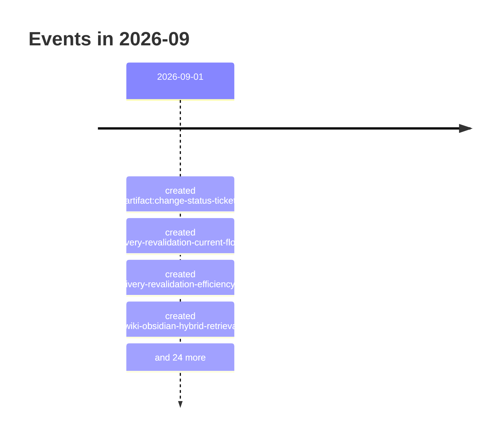

# 2026-09

28 dated event(s). Every date carries the rung that produced it; a date
the resolver could not establish is absent from this page rather than guessed onto it.

## Events

- `2026-09-01` — created of Change Status Ticket (`artifact:change-status-ticket`), from a commit touching the file
- `2026-09-01` — created of Delivery Revalidation Current-Flow and Cost Seed (`artifact:delivery-revalidation-current-flow-and-cost`), from a commit touching the file
- `2026-09-01` — created of Delivery Revalidation Efficiency Wayfinder (`artifact:delivery-revalidation-efficiency-wayfinder`), from a commit touching the file
- `2026-09-01` — created of Obsidian-First LLM Wiki with Measured Hybrid Retrieval (`artifact:llm-wiki-obsidian-hybrid-retrieval-wayfinder`), from a commit touching the file
- `2026-09-01` — created of Disposable hybrid-retrieval benchmark over the Obsidian notes (`artifact:llm-wiki-obsidian-retrieval-benchmark`), from a commit touching the file
- `2026-09-01` — created of Obsidian source-to-contract compatibility (`artifact:llm-wiki-obsidian-source-contract-compatibility`), from a commit touching the file
- `2026-09-01` — created of Lifecycle-only status transaction prototype (`path:docs/prototypes/lifecycle-only-status-transaction/NOTES.md`), from a commit touching the file
- `2026-09-01` — created of LLM Wiki Exact-Source Checkout Sync (`spec:llm-wiki-exact-source-checkout-sync`), from a commit touching the file
- `2026-09-01` — created of Add the repository lifecycle transaction and ignored-source slice (`ticket:change-status-ticket/CST-01`), from a commit touching the file
- `2026-09-01` — disposition-changed of Add the repository lifecycle transaction and ignored-source slice (`ticket:change-status-ticket/CST-01`), from a rename recorded in Git
- `2026-09-01` — created of Deliver tracked status candidates through terminal proof (`ticket:change-status-ticket/CST-02`), from a commit touching the file
- `2026-09-01` — disposition-changed of Deliver tracked status candidates through terminal proof (`ticket:change-status-ticket/CST-02`), from a rename recorded in Git
- `2026-09-01` — created of Enforce mutation barriers and safe-boundary projection (`ticket:change-status-ticket/CST-03`), from a commit touching the file
- `2026-09-01` — disposition-changed of Enforce mutation barriers and safe-boundary projection (`ticket:change-status-ticket/CST-03`), from a rename recorded in Git
- `2026-09-01` — created of Publish the dedicated status-change skill and routing contract (`ticket:change-status-ticket/CST-04`), from a commit touching the file
- `2026-09-01` — disposition-changed of Publish the dedicated status-change skill and routing contract (`ticket:change-status-ticket/CST-04`), from a rename recorded in Git
- `2026-09-01` — created of Map the completion-to-delivery revalidation flow (`ticket:delivery-revalidation-efficiency/DRV-01`), from a commit touching the file
- `2026-09-01` — created of Prototype projection-proof options (`ticket:delivery-revalidation-efficiency/DRV-02`), from a commit touching the file
- `2026-09-01` — created of Choose the final-tree validation architecture (`ticket:delivery-revalidation-efficiency/DRV-03`), from a commit touching the file
- `2026-09-01` — disposition-changed of Prove a lifecycle-only status transaction (`ticket:lightweight-ticket-status-change/TSC-01`), from a rename recorded in Git
- `2026-09-01` — disposition-changed of Specify the dedicated status-change lane (`ticket:lightweight-ticket-status-change/TSC-02`), from a rename recorded in Git
- `2026-09-01` — created of Discover and synchronize the tracked wiki from the exact source checkout (`ticket:llm-wiki-exact-source-checkout-sync/WXS-01`), from a commit touching the file
- `2026-09-01` — disposition-changed of Discover and synchronize the tracked wiki from the exact source checkout (`ticket:llm-wiki-exact-source-checkout-sync/WXS-01`), from a rename recorded in Git
- `2026-09-01` — created of Research source-to-contract compatibility for the Obsidian notes (`ticket:llm-wiki-obsidian-hybrid-retrieval/OHR-01`), from a commit touching the file
- `2026-09-01` — disposition-changed of Research source-to-contract compatibility for the Obsidian notes (`ticket:llm-wiki-obsidian-hybrid-retrieval/OHR-01`), from a rename recorded in Git
- `2026-09-01` — created of Benchmark disposable hybrid retrieval over the Obsidian notes (`ticket:llm-wiki-obsidian-hybrid-retrieval/OHR-02`), from a commit touching the file
- `2026-09-01` — disposition-changed of Benchmark disposable hybrid retrieval over the Obsidian notes (`ticket:llm-wiki-obsidian-hybrid-retrieval/OHR-02`), from a rename recorded in Git
- `2026-09-01` — disposition-changed of Reconcile an exact single-parent integration copy (`ticket:ticket-autopilot-post-merge-integration-copy-reconciliation/ICR-01`), from a rename recorded in Git
