# 2026-09

278 dated event(s). Every date carries the rung that produced it; a date
the resolver could not establish is absent from this page rather than guessed onto it.

```mermaid
timeline
    title Events in 2026-09
    2026-09-01 : created artifact:change-status-ticket : created artifact:delivery-revalidation-current-flow-and-cost : created artifact:delivery-revalidation-efficiency-wayfinder : created artifact:llm-wiki-obsidian-hybrid-retrieval-wayfinder : and 35 more
    2026-09-02 : created artifact:delivery-revalidation-final-tree-validation-decision : created spec:ticket-autopilot-pi-owned-skill-source-migration : disposition-changed ticket:delivery-revalidation-efficiency/DRV-03 : created ticket:delivery-revalidation-final-tree-validation/FTV-01 : and 12 more
    2026-09-03 : created artifact:agent-skills-repair-to-omicron-wayfinder : created artifact:delivery-revalidation-observation-parity-result : created artifact:omicron-code-wayfinder : created spec:llm-wiki-legacy-root-catalog-adoption : and 9 more
    2026-09-04 : created artifact:ticket-autopilot-cross-checkout-wiki-delivery : created artifact:ticket-autopilot-orphan-worktree-garbage-collection : created research:omicron-code-extension-config-inventory : created research:omicron-code-upstream-pi-baseline : and 17 more
    2026-09-05 : created artifact:llm-wiki-semantic-coverage-gap-diagnostic : created artifact:llm-wiki-semantic-coverage-wayfinder : created artifact:ticket-autopilot-stale-excluded-final-tree-projection-diagnostic : created ticket:llm-wiki-semantic-coverage/SW-01 : and 7 more
    2026-09-07 : created artifact:autopilot-practical-reliability : created ticket:autopilot-checkout-preparation/APM-PREP-01 : disposition-changed ticket:autopilot-checkout-preparation/APM-PREP-01 : created ticket:autopilot-practical-reliability/APM-01 : and 16 more
    2026-09-08 : created artifact:llm-wiki-adoption-windows-fchmod : created artifact:llm-wiki-semantic-coverage-prototype : created artifact:ticket-autopilot-provider-body-lossy-readback : created artifact:ticket-autopilot-provider-output-undecodable-bytes : and 17 more
    2026-09-09 : created spec:llm-wiki-semantic-projection-decision : created spec:wiki-git-byte-fidelity : disposition-changed ticket:autopilot-practical-reliability/APM-05 : disposition-changed ticket:autopilot-practical-reliability/APM-06 : and 5 more
    2026-09-10 : created artifact:autopilot-gate-readiness : created artifact:ticket-autopilot-completion-provenance : created ticket:autopilot-gate-readiness/RGC-01 : disposition-changed ticket:autopilot-gate-readiness/RGC-01 : and 6 more
    2026-09-14 : created spec:ticket-autopilot-post-merge-verification-reentry : created ticket:postmerge-verification-reentry/PMV-01 : disposition-changed ticket:postmerge-verification-reentry/PMV-01
    2026-09-15 : created spec:llm-wiki-pi-session-provider : created spec:ticket-autopilot-wiki-noop-reentry : created ticket:llm-wiki-pi-session-provider/PSP-01 : disposition-changed ticket:llm-wiki-pi-session-provider/PSP-01 : and 4 more
    2026-09-16 : created artifact:full-suite-timeout-diagnosis : created artifact:provider-gated-candidate-revalidation : disposition-changed ticket:llm-wiki-pi-session-provider/PSP-02 : disposition-changed ticket:llm-wiki-pi-session-provider/PSP-03 : and 2 more
    2026-09-17 : created artifact:autonomous-stack-reconcile-load-flake : created artifact:autopilot-suite-execution-cost : created artifact:linux-suite-fixture-portability : created artifact:local-verification-profile-contract : and 15 more
    2026-09-19 : created artifact:required-ci-and-main-protection : created spec:llm-wiki-active-session-deferral : created spec:llm-wiki-pi-sessions-in-sync : created spec:no-dangling-work : and 4 more
    2026-09-20 : created artifact:github-required-check-readback : created artifact:skills-only-inline-execution : created ticket:github-required-check-readback/GP-01 : created ticket:skills-only-inline-execution/SH-01
    2026-09-21 : created spec:artifact-graph-baseline-repair : created spec:pr-update-field-scope : created ticket:artifact-graph-baseline-repair/AGB-01 : created ticket:no-dangling-work/NDW-01 : and 4 more
    2026-09-22 : created artifact:autopilot-decision-tree : created artifact:autopilot-protocol-friction : created artifact:public-benchmark-evaluation : created spec:azure-windows-delivery : and 23 more
    2026-09-23 : created artifact:ticket-driver : created artifact:ticket-driver-jev-key-isolation : created spec:ticket-driver-windows-pi-launch : created ticket:autopilot-protocol-friction/APF-07 : and 8 more
    2026-09-24 : created artifact:ticket-driver-directed-review-boundary : created artifact:ticket-driver-judge-identity : created artifact:ticket-driver-review-findings : created ticket:terminal-bench-4-opus55/TBF-01 : and 6 more
    2026-09-25 : created artifact:terminal-bench-best-arm : disposition-changed ticket:terminal-bench-4-opus55/TBF-01 : disposition-changed ticket:terminal-bench-4-opus55/TBF-02 : disposition-changed ticket:terminal-bench-4-opus55/TBF-04 : and 9 more
```

## Events

- `2026-09-01` — created of Change Status Ticket (`artifact:change-status-ticket`), from a commit touching the file
- `2026-09-01` — created of Delivery Revalidation Current Flow and Cost (`artifact:delivery-revalidation-current-flow-and-cost`), from a commit touching the file
- `2026-09-01` — created of Delivery Revalidation Efficiency Wayfinder (`artifact:delivery-revalidation-efficiency-wayfinder`), from a commit touching the file
- `2026-09-01` — created of Obsidian-First LLM Wiki with Measured Hybrid Retrieval (`artifact:llm-wiki-obsidian-hybrid-retrieval-wayfinder`), from a commit touching the file
- `2026-09-01` — created of Disposable hybrid-retrieval benchmark over the Obsidian notes (`artifact:llm-wiki-obsidian-retrieval-benchmark`), from a commit touching the file
- `2026-09-01` — created of Obsidian source-to-contract compatibility (`artifact:llm-wiki-obsidian-source-contract-compatibility`), from a commit touching the file
- `2026-09-01` — created of Ticket Autopilot Runner Defect Remediation (`artifact:ticket-autopilot-runner-defect-remediation`), from a commit touching the file
- `2026-09-01` — created of Lifecycle-only status transaction prototype (`path:docs/prototypes/lifecycle-only-status-transaction/NOTES.md`), from a commit touching the file
- `2026-09-01` — created of LLM Wiki Exact-Source Checkout Sync (`spec:llm-wiki-exact-source-checkout-sync`), from a commit touching the file
- `2026-09-01` — created of Add the repository lifecycle transaction and ignored-source slice (`ticket:change-status-ticket/CST-01`), from a commit touching the file
- `2026-09-01` — disposition-changed of Add the repository lifecycle transaction and ignored-source slice (`ticket:change-status-ticket/CST-01`), from a rename recorded in Git
- `2026-09-01` — created of Deliver tracked status candidates through terminal proof (`ticket:change-status-ticket/CST-02`), from a commit touching the file
- `2026-09-01` — disposition-changed of Deliver tracked status candidates through terminal proof (`ticket:change-status-ticket/CST-02`), from a rename recorded in Git
- `2026-09-01` — created of Enforce mutation barriers and safe-boundary projection (`ticket:change-status-ticket/CST-03`), from a commit touching the file
- `2026-09-01` — disposition-changed of Enforce mutation barriers and safe-boundary projection (`ticket:change-status-ticket/CST-03`), from a rename recorded in Git
- `2026-09-01` — created of Publish the dedicated status-change skill and routing contract (`ticket:change-status-ticket/CST-04`), from a commit touching the file
- `2026-09-01` — disposition-changed of Publish the dedicated status-change skill and routing contract (`ticket:change-status-ticket/CST-04`), from a rename recorded in Git
- `2026-09-01` — created of Map the completion-to-delivery revalidation flow (`ticket:delivery-revalidation-efficiency/DRV-01`), from a commit touching the file
- `2026-09-01` — disposition-changed of Map the completion-to-delivery revalidation flow (`ticket:delivery-revalidation-efficiency/DRV-01`), from a rename recorded in Git
- `2026-09-01` — created of Prototype projection-proof options (`ticket:delivery-revalidation-efficiency/DRV-02`), from a commit touching the file
- `2026-09-01` — disposition-changed of Prototype projection-proof options (`ticket:delivery-revalidation-efficiency/DRV-02`), from a rename recorded in Git
- `2026-09-01` — created of Choose the final-tree validation architecture (`ticket:delivery-revalidation-efficiency/DRV-03`), from a commit touching the file
- `2026-09-01` — disposition-changed of Prove a lifecycle-only status transaction (`ticket:lightweight-ticket-status-change/TSC-01`), from a rename recorded in Git
- `2026-09-01` — disposition-changed of Specify the dedicated status-change lane (`ticket:lightweight-ticket-status-change/TSC-02`), from a rename recorded in Git
- `2026-09-01` — created of Preserve hand-written root catalog sections during sync (`ticket:llm-wiki-docs-only-autosync/WS-08`), from a commit touching the file
- `2026-09-01` — created of Discover and synchronize the tracked wiki from the exact source checkout (`ticket:llm-wiki-exact-source-checkout-sync/WXS-01`), from a commit touching the file
- `2026-09-01` — disposition-changed of Discover and synchronize the tracked wiki from the exact source checkout (`ticket:llm-wiki-exact-source-checkout-sync/WXS-01`), from a rename recorded in Git
- `2026-09-01` — created of Research source-to-contract compatibility for the Obsidian notes (`ticket:llm-wiki-obsidian-hybrid-retrieval/OHR-01`), from a commit touching the file
- `2026-09-01` — disposition-changed of Research source-to-contract compatibility for the Obsidian notes (`ticket:llm-wiki-obsidian-hybrid-retrieval/OHR-01`), from a rename recorded in Git
- `2026-09-01` — created of Benchmark disposable hybrid retrieval over the Obsidian notes (`ticket:llm-wiki-obsidian-hybrid-retrieval/OHR-02`), from a commit touching the file
- `2026-09-01` — disposition-changed of Benchmark disposable hybrid retrieval over the Obsidian notes (`ticket:llm-wiki-obsidian-hybrid-retrieval/OHR-02`), from a rename recorded in Git
- `2026-09-01` — disposition-changed of Reconcile an exact single-parent integration copy (`ticket:ticket-autopilot-post-merge-integration-copy-reconciliation/ICR-01`), from a rename recorded in Git
- `2026-09-01` — created of Reset stale delivery preparation after candidate invalidation (`ticket:ticket-autopilot-runner-defect-remediation/RDR-01`), from a commit touching the file
- `2026-09-01` — disposition-changed of Reset stale delivery preparation after candidate invalidation (`ticket:ticket-autopilot-runner-defect-remediation/RDR-01`), from a rename recorded in Git
- `2026-09-01` — created of Prioritize explicit reconciliation over pending merge (`ticket:ticket-autopilot-runner-defect-remediation/RDR-02`), from a commit touching the file
- `2026-09-01` — disposition-changed of Prioritize explicit reconciliation over pending merge (`ticket:ticket-autopilot-runner-defect-remediation/RDR-02`), from a rename recorded in Git
- `2026-09-01` — created of Consume all resolved reconciliation gates (`ticket:ticket-autopilot-runner-defect-remediation/RDR-03`), from a commit touching the file
- `2026-09-01` — created of Make PR-body persistence byte-stable across platforms (`ticket:ticket-autopilot-runner-defect-remediation/RDR-04`), from a commit touching the file
- `2026-09-01` — created of Unify autonomous readiness for precompleted dependencies (`ticket:ticket-autopilot-runner-defect-remediation/RDR-05`), from a commit touching the file
- `2026-09-02` — created of Final-Tree Validation Architecture Decision (`artifact:delivery-revalidation-final-tree-validation-decision`), from a commit touching the file
- `2026-09-02` — created of Migrate the Pi owned-skill source explicitly (`spec:ticket-autopilot-pi-owned-skill-source-migration`), from a commit touching the file
- `2026-09-02` — disposition-changed of Choose the final-tree validation architecture (`ticket:delivery-revalidation-efficiency/DRV-03`), from a rename recorded in Git
- `2026-09-02` — created of Observe Exact Tracked Completion Projections (`ticket:delivery-revalidation-final-tree-validation/FTV-01`), from a commit touching the file
- `2026-09-02` — disposition-changed of Observe Exact Tracked Completion Projections (`ticket:delivery-revalidation-final-tree-validation/FTV-01`), from a rename recorded in Git
- `2026-09-02` — created of Persist and Recover Projected-Not-Integrated Completion (`ticket:delivery-revalidation-final-tree-validation/FTV-02`), from a commit touching the file
- `2026-09-02` — disposition-changed of Persist and Recover Projected-Not-Integrated Completion (`ticket:delivery-revalidation-final-tree-validation/FTV-02`), from a rename recorded in Git
- `2026-09-02` — created of Run One Final Quality Cycle on the Exact Delivery Tree (`ticket:delivery-revalidation-final-tree-validation/FTV-03`), from a commit touching the file
- `2026-09-02` — disposition-changed of Run One Final Quality Cycle on the Exact Delivery Tree (`ticket:delivery-revalidation-final-tree-validation/FTV-03`), from a rename recorded in Git
- `2026-09-02` — created of Prove Observation Parity and Safe Rollback (`ticket:delivery-revalidation-final-tree-validation/FTV-04`), from a commit touching the file
- `2026-09-02` — created of Enable the Bounded Tracked Final-Tree Lane (`ticket:delivery-revalidation-final-tree-validation/FTV-05`), from a commit touching the file
- `2026-09-02` — disposition-changed of Preserve hand-written root catalog sections during sync (`ticket:llm-wiki-docs-only-autosync/WS-08`), from a rename recorded in Git
- `2026-09-02` — created of Migrate an exact owned-skill source (`ticket:ticket-autopilot-pi-owned-skill-source-migration/PSM-01`), from a commit touching the file
- `2026-09-02` — disposition-changed of Consume all resolved reconciliation gates (`ticket:ticket-autopilot-runner-defect-remediation/RDR-03`), from a rename recorded in Git
- `2026-09-02` — disposition-changed of Make PR-body persistence byte-stable across platforms (`ticket:ticket-autopilot-runner-defect-remediation/RDR-04`), from a rename recorded in Git
- `2026-09-02` — disposition-changed of Unify autonomous readiness for precompleted dependencies (`ticket:ticket-autopilot-runner-defect-remediation/RDR-05`), from a rename recorded in Git
- `2026-09-03` — created of Agent Skills repair-to-Omicron work queue (`artifact:agent-skills-repair-to-omicron-wayfinder`), from a commit touching the file
- `2026-09-03` — created of Final-Tree Observation, Parity, and Rollback Evidence (`artifact:delivery-revalidation-observation-parity-result`), from a commit touching the file
- `2026-09-03` — created of Omicron Code (`artifact:omicron-code-wayfinder`), from a commit touching the file
- `2026-09-03` — created of LLM Wiki legacy root-catalog adoption (`spec:llm-wiki-legacy-root-catalog-adoption`), from a commit touching the file
- `2026-09-03` — created of Pi Break Glass natural-language local repair (`spec:pi-break-glass-natural-language-local-repair`), from a commit touching the file
- `2026-09-03` — created of Natural-language repository-wide merge-all intent (`spec:ticket-autopilot-natural-language-merge-all-intent`), from a commit touching the file
- `2026-09-03` — created of Worktree-stable repository authority (`spec:ticket-autopilot-worktree-stable-repository-authority`), from a commit touching the file
- `2026-09-03` — disposition-changed of Prove Observation Parity and Safe Rollback (`ticket:delivery-revalidation-final-tree-validation/FTV-04`), from a rename recorded in Git
- `2026-09-03` — disposition-changed of Enable the Bounded Tracked Final-Tree Lane (`ticket:delivery-revalidation-final-tree-validation/FTV-05`), from a rename recorded in Git
- `2026-09-03` — created of Adopt the Agent Skills legacy root catalog (`ticket:llm-wiki-legacy-root-catalog-adoption/WCA-01`), from a commit touching the file
- `2026-09-03` — disposition-changed of Adopt the Agent Skills legacy root catalog (`ticket:llm-wiki-legacy-root-catalog-adoption/WCA-01`), from a rename recorded in Git
- `2026-09-03` — created of Enable one-turn natural-language local repair (`ticket:pi-break-glass-natural-language-local-repair/BGR-01`), from a commit touching the file
- `2026-09-03` — disposition-changed of Enable one-turn natural-language local repair (`ticket:pi-break-glass-natural-language-local-repair/BGR-01`), from a rename recorded in Git
- `2026-09-04` — created of Ticket Autopilot cross-checkout wiki delivery (`artifact:ticket-autopilot-cross-checkout-wiki-delivery`), from a commit touching the file
- `2026-09-04` — created of Ticket Autopilot orphan-worktree garbage collection (`artifact:ticket-autopilot-orphan-worktree-garbage-collection`), from a commit touching the file
- `2026-09-04` — created of Omicron Code Extension and Configuration Inventory (`research:omicron-code-extension-config-inventory`), from a commit touching the file
- `2026-09-04` — created of Omicron Code Upstream Pi Baseline (`research:omicron-code-upstream-pi-baseline`), from a commit touching the file
- `2026-09-04` — created of Ask Skills Execution Tool Discipline (`spec:ask-skills-execution-tool-discipline`), from a commit touching the file
- `2026-09-04` — created of Enforce routed tool-use defaults (`ticket:ask-skills-execution-tool-discipline/ATD-01`), from a commit touching the file
- `2026-09-04` — disposition-changed of Enforce routed tool-use defaults (`ticket:ask-skills-execution-tool-discipline/ATD-01`), from a rename recorded in Git
- `2026-09-04` — created of Map the upstream Pi baseline (`ticket:omicron-code/OMC-01`), from a commit touching the file
- `2026-09-04` — disposition-changed of Map the upstream Pi baseline (`ticket:omicron-code/OMC-01`), from a rename recorded in Git
- `2026-09-04` — created of Inventory active extensions and configuration (`ticket:omicron-code/OMC-02`), from a commit touching the file
- `2026-09-04` — disposition-changed of Inventory active extensions and configuration (`ticket:omicron-code/OMC-02`), from a rename recorded in Git
- `2026-09-04` — created of Deliver tracked wiki candidates through the canonical target (`ticket:ticket-autopilot-cross-checkout-wiki-delivery/WDT-01`), from a commit touching the file
- `2026-09-04` — disposition-changed of Deliver tracked wiki candidates through the canonical target (`ticket:ticket-autopilot-cross-checkout-wiki-delivery/WDT-01`), from a rename recorded in Git
- `2026-09-04` — created of Restore natural-language repository-wide merge-all intent (`ticket:ticket-autopilot-natural-language-merge-all-intent/MAR-01`), from a commit touching the file
- `2026-09-04` — disposition-changed of Restore natural-language repository-wide merge-all intent (`ticket:ticket-autopilot-natural-language-merge-all-intent/MAR-01`), from a rename recorded in Git
- `2026-09-04` — created of Register ownership and plan orphan cleanup (`ticket:ticket-autopilot-orphan-worktree-garbage-collection/WGC-01`), from a commit touching the file
- `2026-09-04` — disposition-changed of Register ownership and plan orphan cleanup (`ticket:ticket-autopilot-orphan-worktree-garbage-collection/WGC-01`), from a rename recorded in Git
- `2026-09-04` — created of Apply an exact guarded cleanup plan (`ticket:ticket-autopilot-orphan-worktree-garbage-collection/WGC-02`), from a commit touching the file
- `2026-09-04` — disposition-changed of Apply an exact guarded cleanup plan (`ticket:ticket-autopilot-orphan-worktree-garbage-collection/WGC-02`), from a rename recorded in Git
- `2026-09-04` — created of Make repository authority worktree-stable (`ticket:ticket-autopilot-worktree-stable-repository-authority/MRA-01`), from a commit touching the file
- `2026-09-04` — disposition-changed of Make repository authority worktree-stable (`ticket:ticket-autopilot-worktree-stable-repository-authority/MRA-01`), from a rename recorded in Git
- `2026-09-05` — created of LLM Wiki Semantic Coverage Gap (`artifact:llm-wiki-semantic-coverage-gap-diagnostic`), from a commit touching the file
- `2026-09-05` — created of LLM Wiki Semantic Coverage Recovery (`artifact:llm-wiki-semantic-coverage-wayfinder`), from a commit touching the file
- `2026-09-05` — created of Ticket Autopilot Stale Excluded Final-Tree Projection Reset (`artifact:ticket-autopilot-stale-excluded-final-tree-projection-diagnostic`), from a commit touching the file
- `2026-09-05` — created of Measure semantic projection options (`ticket:llm-wiki-semantic-coverage/SW-01`), from a commit touching the file
- `2026-09-05` — created of Confirm semantic projection and lint policy (`ticket:llm-wiki-semantic-coverage/SW-02`), from a commit touching the file
- `2026-09-05` — created of Compile structured semantic content (`ticket:llm-wiki-semantic-coverage/SW-03`), from a commit touching the file
- `2026-09-05` — created of Enforce semantic coverage in wiki lint (`ticket:llm-wiki-semantic-coverage/SW-04`), from a commit touching the file
- `2026-09-05` — created of Require and display concrete stage-gate causes (`ticket:llm-wiki-semantic-coverage/SW-05`), from a commit touching the file
- `2026-09-05` — created of Repair evidence-backed historical gate causes (`ticket:llm-wiki-semantic-coverage/SW-06`), from a commit touching the file
- `2026-09-05` — created of Reset stale excluded projection after candidate change (`ticket:ticket-autopilot-stale-excluded-final-tree-projection/FPR-01`), from a commit touching the file
- `2026-09-05` — disposition-changed of Reset stale excluded projection after candidate change (`ticket:ticket-autopilot-stale-excluded-final-tree-projection/FPR-01`), from a rename recorded in Git
- `2026-09-07` — created of Practical Reliability for Ticket Autopilot (`artifact:autopilot-practical-reliability`), from a commit touching the file
- `2026-09-07` — created of Rebind the existing wiki to the selected Windows checkout (`ticket:autopilot-checkout-preparation/APM-PREP-01`), from a commit touching the file
- `2026-09-07` — disposition-changed of Rebind the existing wiki to the selected Windows checkout (`ticket:autopilot-checkout-preparation/APM-PREP-01`), from a rename recorded in Git
- `2026-09-07` — created of Adopt practical prompt defaults and explicit-user-only delegation (`ticket:autopilot-practical-reliability/APM-01`), from a commit touching the file
- `2026-09-07` — disposition-changed of Adopt practical prompt defaults and explicit-user-only delegation (`ticket:autopilot-practical-reliability/APM-01`), from a rename recorded in Git
- `2026-09-07` — created of Make final-tree receipt paths portable at the real Git boundary (`ticket:autopilot-practical-reliability/APM-02`), from a commit touching the file
- `2026-09-07` — disposition-changed of Make final-tree receipt paths portable at the real Git boundary (`ticket:autopilot-practical-reliability/APM-02`), from a rename recorded in Git
- `2026-09-07` — created of Isolate Git fixtures and make line-ending behavior explicit (`ticket:autopilot-practical-reliability/APM-03`), from a commit touching the file
- `2026-09-07` — disposition-changed of Isolate Git fixtures and make line-ending behavior explicit (`ticket:autopilot-practical-reliability/APM-03`), from a rename recorded in Git
- `2026-09-07` — created of Provide one cross-platform quick/full local test entry point (`ticket:autopilot-practical-reliability/APM-04`), from a commit touching the file
- `2026-09-07` — created of Bound Git/provider commands with timeout, cancellation, and output limits (`ticket:autopilot-practical-reliability/APM-05`), from a commit touching the file
- `2026-09-07` — created of Extract one final-tree workflow boundary from the large dispatchers (`ticket:autopilot-practical-reliability/APM-06`), from a commit touching the file
- `2026-09-07` — created of Move rare operational procedures behind clear prompt references (`ticket:autopilot-practical-reliability/APM-07`), from a commit touching the file
- `2026-09-07` — created of Report local phase durations and retries from existing observations (`ticket:autopilot-practical-reliability/APM-08`), from a commit touching the file
- `2026-09-07` — created of Decode localized Azure CLI JSON without weakening strict Git data (`ticket:autopilot-practical-reliability/APM-09`), from a commit touching the file
- `2026-09-07` — created of Accept Windows Git path separators without weakening worktree GC (`ticket:ticket-autopilot-orphan-worktree-garbage-collection/WGC-03`), from a commit touching the file
- `2026-09-07` — disposition-changed of Accept Windows Git path separators without weakening worktree GC (`ticket:ticket-autopilot-orphan-worktree-garbage-collection/WGC-03`), from a rename recorded in Git
- `2026-09-07` — created of Make wiki project bindings portable across checkouts and computers (`ticket:wiki-portable-checkouts/APM-10`), from a commit touching the file
- `2026-09-07` — disposition-changed of Make wiki project bindings portable across checkouts and computers (`ticket:wiki-portable-checkouts/APM-10`), from a rename recorded in Git
- `2026-09-07` — created of Deliver long-path wiki candidates on Windows and recover the exact pre-provider failure (`ticket:wiki-portable-checkouts/APM-11`), from a commit touching the file
- `2026-09-08` — created of Catalog adoption cannot run on Windows: `os.fchmod` does not exist there (`artifact:llm-wiki-adoption-windows-fchmod`), from a commit touching the file
- `2026-09-08` — created of Semantic projection comparison — NON-PRODUCTION (`artifact:llm-wiki-semantic-coverage-prototype`), from a commit touching the file
- `2026-09-08` — created of Un carácter que el proveedor devuelve mutilado invalida la transacción entera (`artifact:ticket-autopilot-provider-body-lossy-readback`), from a commit touching the file
- `2026-09-08` — created of Provider output carries bytes the runner refuses to read, after the mutation already landed (`artifact:ticket-autopilot-provider-output-undecodable-bytes`), from a commit touching the file
- `2026-09-08` — created of La propiedad de un run no se libera nunca, y bloquea los cambios de estado de toda la carpeta (`artifact:ticket-autopilot-run-ownership-deadlock`), from a commit touching the file
- `2026-09-08` — created of Windows Index Path Separator in Tracked Completion Projection (`spec:ticket-autopilot-windows-projection-index-path`), from a commit touching the file
- `2026-09-08` — disposition-changed of Provide one cross-platform quick/full local test entry point (`ticket:autopilot-practical-reliability/APM-04`), from a rename recorded in Git
- `2026-09-08` — disposition-changed of Move rare operational procedures behind clear prompt references (`ticket:autopilot-practical-reliability/APM-07`), from a rename recorded in Git
- `2026-09-08` — created of Guard the POSIX-only `fchmod` so adoption runs on both platforms (`ticket:llm-wiki-adoption-windows-fchmod/WFC-01`), from a commit touching the file
- `2026-09-08` — disposition-changed of Guard the POSIX-only `fchmod` so adoption runs on both platforms (`ticket:llm-wiki-adoption-windows-fchmod/WFC-01`), from a rename recorded in Git
- `2026-09-08` — disposition-changed of Measure semantic projection options (`ticket:llm-wiki-semantic-coverage/SW-01`), from a rename recorded in Git
- `2026-09-08` — disposition-changed of Require and display concrete stage-gate causes (`ticket:llm-wiki-semantic-coverage/SW-05`), from a rename recorded in Git
- `2026-09-08` — created of El cuerpo que va al proveedor es ASCII (`ticket:ticket-autopilot-provider-body-lossy-readback/PBL-01`), from a commit touching the file
- `2026-09-08` — disposition-changed of El cuerpo que va al proveedor es ASCII (`ticket:ticket-autopilot-provider-body-lossy-readback/PBL-01`), from a rename recorded in Git
- `2026-09-08` — created of Ask Azure for the seven fields the runner reads, not the whole object (`ticket:ticket-autopilot-provider-output-undecodable-bytes/PUB-01`), from a commit touching the file
- `2026-09-08` — disposition-changed of Ask Azure for the seven fields the runner reads, not the whole object (`ticket:ticket-autopilot-provider-output-undecodable-bytes/PUB-01`), from a rename recorded in Git
- `2026-09-08` — created of La resolución de propiedad descarta los runs cuyo ciclo de vida ya terminó (`ticket:ticket-autopilot-run-ownership-deadlock/ROD-01`), from a commit touching the file
- `2026-09-08` — disposition-changed of La resolución de propiedad descarta los runs cuyo ciclo de vida ya terminó (`ticket:ticket-autopilot-run-ownership-deadlock/ROD-01`), from a rename recorded in Git
- `2026-09-08` — created of Build the completion receipt path as a POSIX index path (`ticket:ticket-autopilot-windows-projection-index-path/WPS-01`), from a commit touching the file
- `2026-09-08` — disposition-changed of Build the completion receipt path as a POSIX index path (`ticket:ticket-autopilot-windows-projection-index-path/WPS-01`), from a rename recorded in Git
- `2026-09-08` — disposition-changed of Deliver long-path wiki candidates on Windows and recover the exact pre-provider failure (`ticket:wiki-portable-checkouts/APM-11`), from a rename recorded in Git
- `2026-09-09` — created of Deterministic, complete semantic source projection (`spec:llm-wiki-semantic-projection-decision`), from a commit touching the file
- `2026-09-09` — created of Tracked wiki Git-byte fidelity (`spec:wiki-git-byte-fidelity`), from a commit touching the file
- `2026-09-09` — disposition-changed of Bound Git/provider commands with timeout, cancellation, and output limits (`ticket:autopilot-practical-reliability/APM-05`), from a rename recorded in Git
- `2026-09-09` — disposition-changed of Extract one final-tree workflow boundary from the large dispatchers (`ticket:autopilot-practical-reliability/APM-06`), from a rename recorded in Git
- `2026-09-09` — disposition-changed of Report local phase durations and retries from existing observations (`ticket:autopilot-practical-reliability/APM-08`), from a rename recorded in Git
- `2026-09-09` — disposition-changed of Decode localized Azure CLI JSON without weakening strict Git data (`ticket:autopilot-practical-reliability/APM-09`), from a rename recorded in Git
- `2026-09-09` — disposition-changed of Confirm semantic projection and lint policy (`ticket:llm-wiki-semantic-coverage/SW-02`), from a rename recorded in Git
- `2026-09-09` — created of WBF-01 — Freeze and deliver exact Git-representation wiki bytes (`ticket:wiki-git-byte-fidelity/WBF-01`), from a commit touching the file
- `2026-09-09` — disposition-changed of WBF-01 — Freeze and deliver exact Git-representation wiki bytes (`ticket:wiki-git-byte-fidelity/WBF-01`), from a rename recorded in Git
- `2026-09-10` — created of Distinguish technical gates from human decisions (`artifact:autopilot-gate-readiness`), from a commit touching the file
- `2026-09-10` — created of Preserve completion provenance across final-candidate corrections (`artifact:ticket-autopilot-completion-provenance`), from a commit touching the file
- `2026-09-10` — created of Distinguish technical gates and reuse exact existing authority (`ticket:autopilot-gate-readiness/RGC-01`), from a commit touching the file
- `2026-09-10` — disposition-changed of Distinguish technical gates and reuse exact existing authority (`ticket:autopilot-gate-readiness/RGC-01`), from a rename recorded in Git
- `2026-09-10` — disposition-changed of Compile structured semantic content (`ticket:llm-wiki-semantic-coverage/SW-03`), from a rename recorded in Git
- `2026-09-10` — disposition-changed of Enforce semantic coverage in wiki lint (`ticket:llm-wiki-semantic-coverage/SW-04`), from a rename recorded in Git
- `2026-09-10` — created of Invoke installed Pi natively on Windows (`ticket:pi-sync-windows/WPI-01`), from a commit touching the file
- `2026-09-10` — disposition-changed of Invoke installed Pi natively on Windows (`ticket:pi-sync-windows/WPI-01`), from a rename recorded in Git
- `2026-09-10` — created of Preserve completion provenance during candidate correction (`ticket:ticket-autopilot-completion-provenance/CPR-01`), from a commit touching the file
- `2026-09-10` — disposition-changed of Preserve completion provenance during candidate correction (`ticket:ticket-autopilot-completion-provenance/CPR-01`), from a rename recorded in Git
- `2026-09-14` — created of Post-merge source verification reentry (`spec:ticket-autopilot-post-merge-verification-reentry`), from a commit touching the file
- `2026-09-14` — created of PMV-01 — Verify merged source without reopening delivery (`ticket:postmerge-verification-reentry/PMV-01`), from a commit touching the file
- `2026-09-14` — disposition-changed of PMV-01 — Verify merged source without reopening delivery (`ticket:postmerge-verification-reentry/PMV-01`), from a rename recorded in Git
- `2026-09-15` — created of LLM Wiki Pi session provider (`spec:llm-wiki-pi-session-provider`), from a commit touching the file
- `2026-09-15` — created of Tracked wiki already-at-target delivery and exact reentry (`spec:ticket-autopilot-wiki-noop-reentry`), from a commit touching the file
- `2026-09-15` — created of PSP-01 — Read session text from nested message content (`ticket:llm-wiki-pi-session-provider/PSP-01`), from a commit touching the file
- `2026-09-15` — disposition-changed of PSP-01 — Read session text from nested message content (`ticket:llm-wiki-pi-session-provider/PSP-01`), from a rename recorded in Git
- `2026-09-15` — created of PSP-02 — Compile Pi sessions through binding-declared providers (`ticket:llm-wiki-pi-session-provider/PSP-02`), from a commit touching the file
- `2026-09-15` — created of PSP-03 — Bound and document large-transcript ingest (`ticket:llm-wiki-pi-session-provider/PSP-03`), from a commit touching the file
- `2026-09-15` — created of Recognize an already-delivered wiki and recover its exact failure (`ticket:ticket-autopilot-wiki-noop-reentry/WNOP-01`), from a commit touching the file
- `2026-09-15` — disposition-changed of Recognize an already-delivered wiki and recover its exact failure (`ticket:ticket-autopilot-wiki-noop-reentry/WNOP-01`), from a rename recorded in Git
- `2026-09-16` — created of Why the full local profile stalls on Windows (`artifact:full-suite-timeout-diagnosis`), from a commit touching the file
- `2026-09-16` — created of Provider-gated candidate revalidation (`artifact:provider-gated-candidate-revalidation`), from a commit touching the file
- `2026-09-16` — disposition-changed of PSP-02 — Compile Pi sessions through binding-declared providers (`ticket:llm-wiki-pi-session-provider/PSP-02`), from a rename recorded in Git
- `2026-09-16` — disposition-changed of PSP-03 — Bound and document large-transcript ingest (`ticket:llm-wiki-pi-session-provider/PSP-03`), from a rename recorded in Git
- `2026-09-16` — created of Revalidate a changed provider-gated candidate (`ticket:provider-gated-candidate-revalidation/PGR-01`), from a commit touching the file
- `2026-09-16` — disposition-changed of Revalidate a changed provider-gated candidate (`ticket:provider-gated-candidate-revalidation/PGR-01`), from a rename recorded in Git
- `2026-09-17` — created of Un caso de reconciliación autónoma falló una vez bajo la suite completa y no se reproduce aislado (`artifact:autonomous-stack-reconcile-load-flake`), from a commit touching the file
- `2026-09-17` — created of La suite tarda 8,3 horas porque cada comando arranca un intérprete Python entero (`artifact:autopilot-suite-execution-cost`), from a commit touching the file
- `2026-09-17` — created of Prerrequisito Linux: fixtures portables sin reducir garantías (`artifact:linux-suite-fixture-portability`), from a commit touching the file
- `2026-09-17` — created of Contrato de verificación local: gate rápido y cobertura completa (`artifact:local-verification-profile-contract`), from a commit touching the file
- `2026-09-17` — created of Qué comandos git emite el runner, cuántas veces y cuánto cuestan (`artifact:runner-git-command-histogram`), from a commit touching the file
- `2026-09-17` — created of Bajar el coste cotidiano de verificación sin perder la cobertura completa (`artifact:suite-cost-one-percent-wayfinder`), from a commit touching the file
- `2026-09-17` — created of ¿Cuántos casos de `test_cli` no cubren nada que otro caso no cubra? (`artifact:test-cli-coverage-redundancy`), from a commit touching the file
- `2026-09-17` — created of El lanzamiento suspendido de Windows puede dejar un `git.exe` sin liberar y esperar hasta el timeout (`artifact:windows-stderr-eof-stall`), from a commit touching the file
- `2026-09-17` — created of Contener el objetivo en Windows lanzándolo suspendido, sin intérprete supervisor (`ticket:autopilot-suite-execution-cost/01`), from a commit touching the file
- `2026-09-17` — created of Construir el repositorio de fixture una vez por clase y copiarlo por caso (`ticket:autopilot-suite-execution-cost/02`), from a commit touching the file
- `2026-09-17` — created of Repartir los checks por duración medida y dar timeout proporcional al chunk (`ticket:autopilot-suite-execution-cost/03`), from a commit touching the file
- `2026-09-17` — created of Corregir los fixtures Linux y verificar ambos hosts (`ticket:linux-suite-fixture-portability/01`), from a commit touching the file
- `2026-09-17` — created of Sacar la forward matrix del perfil `full` y dejarla como comando explícito de release (`ticket:suite-cost-one-percent/01`), from a commit touching the file
- `2026-09-17` — created of Histograma de comandos git por operación del runner (`ticket:suite-cost-one-percent/02`), from a commit touching the file
- `2026-09-17` — created of Matriz de cobertura por caso de `test_cli`: qué casos no cubren nada que otro no cubra (`ticket:suite-cost-one-percent/03`), from a commit touching the file
- `2026-09-17` — created of Decidir el contrato de perfiles y qué cobertura e2e con Git real es irrenunciable (`ticket:suite-cost-one-percent/04`), from a commit touching the file
- `2026-09-17` — created of Quitar del runner los comandos git repetidos dentro de una misma operación (`ticket:suite-cost-one-percent/05`), from a commit touching the file
- `2026-09-17` — created of Implementar el gate rápido sin recortar la cobertura de `full` (`ticket:suite-cost-one-percent/06`), from a commit touching the file
- `2026-09-17` — disposition-changed of Implementar el gate rápido sin recortar la cobertura de `full` (`ticket:suite-cost-one-percent/06`), from a rename recorded in Git
- `2026-09-19` — created of CI obligatoria en PRs y protección de `main` (`artifact:required-ci-and-main-protection`), from a commit touching the file
- `2026-09-19` — created of Defer the active Pi session during wiki sync (`spec:llm-wiki-active-session-deferral`), from a commit touching the file
- `2026-09-19` — created of Sesiones de Pi en la sincronización del wiki (`spec:llm-wiki-pi-sessions-in-sync`), from a commit touching the file
- `2026-09-19` — created of Ningún trabajo colgado al cerrar una fase (`spec:no-dangling-work`), from a commit touching the file
- `2026-09-19` — created of Checkpoint de revisión del plan (`spec:plan-review-checkpoint`), from a commit touching the file
- `2026-09-19` — created of ASD-01 — Defer the active Pi session (`ticket:llm-wiki-active-session-deferral/ASD-01`), from a commit touching the file
- `2026-09-19` — disposition-changed of ASD-01 — Defer the active Pi session (`ticket:llm-wiki-active-session-deferral/ASD-01`), from a rename recorded in Git
- `2026-09-19` — created of Resolver los worktrees con proyección a medias que existen hoy (`ticket:no-dangling-work/NDW-04`), from a commit touching the file
- `2026-09-20` — created of GitHub required-check policy readback (`artifact:github-required-check-readback`), from a commit touching the file
- `2026-09-20` — created of Skills-only inline execution (`artifact:skills-only-inline-execution`), from a commit touching the file
- `2026-09-20` — created of GP-01 — Observe all GitHub required-check policies (`ticket:github-required-check-readback/GP-01`), from a commit touching the file
- `2026-09-20` — created of SH-01 — Support skills-only inline execution (`ticket:skills-only-inline-execution/SH-01`), from a commit touching the file
- `2026-09-21` — created of Reparar el baseline del grafo de artifacts sin reescribir su historia (`spec:artifact-graph-baseline-repair`), from a commit touching the file
- `2026-09-21` — created of Actualizar una pull request sin mandar campos que no cambian (`spec:pr-update-field-scope`), from a commit touching the file
- `2026-09-21` — created of AGB-01 — Restaurar un grafo verificable conservando la historia (`ticket:artifact-graph-baseline-repair/AGB-01`), from a commit touching the file
- `2026-09-21` — created of Añadir el estado del árbol como sexta comprobación del checkpoint (`ticket:no-dangling-work/NDW-01`), from a commit touching the file
- `2026-09-21` — created of Operación `worktree-sweep` para los temporales que el runner crea (`ticket:no-dangling-work/NDW-02`), from a commit touching the file
- `2026-09-21` — created of Declarar el seguimiento de los JSON por test del prototipo de cobertura (`ticket:no-dangling-work/NDW-03`), from a commit touching the file
- `2026-09-21` — created of PUF-01 — Mandar solo los campos que cambian al actualizar una pull request (`ticket:pr-update-field-scope/PUF-01`), from a commit touching the file
- `2026-09-21` — created of WGC-04 — Bound redundant GC planning work with an invocation snapshot (`ticket:ticket-autopilot-orphan-worktree-garbage-collection/WGC-04`), from a commit touching the file
- `2026-09-22` — created of El árbol decisional de Autopilot (`artifact:autopilot-decision-tree`), from a commit touching the file
- `2026-09-22` — created of Por qué Autopilot es lento: la fricción del protocolo (`artifact:autopilot-protocol-friction`), from a commit touching the file
- `2026-09-22` — created of Medir Pi y Autopilot en un benchmark público duro (`artifact:public-benchmark-evaluation`), from a commit touching the file
- `2026-09-22` — created of Entregar una PR de Azure DevOps desde Windows sin que cmd.exe reinterprete el cuerpo (`spec:azure-windows-delivery`), from a commit touching the file
- `2026-09-22` — created of Escribir las tres reglas de disciplina que las sesiones ya pagaron (`spec:measurable-agent-discipline`), from a commit touching the file
- `2026-09-22` — created of «Autorizzo tutto»: una autorización operativa por repositorio, duradera y revocable (`spec:repository-operational-authority`), from a commit touching the file
- `2026-09-22` — created of Compilar una wiki no debe pagar dos veces por la misma respuesta (`spec:wiki-compile-process-cost`), from a commit touching the file
- `2026-09-22` — created of Limpieza de worktrees: probar la retención, no suponerla (`spec:worktree-cleanup-retention`), from a commit touching the file
- `2026-09-22` — created of Limpiar los avisos de lint pendientes en el recolector de worktrees (`spec:worktree-gc-lint-debt`), from a commit touching the file
- `2026-09-22` — created of ADT-01 — Dibujar el árbol decisional de Autopilot (`ticket:autopilot-decision-tree/ADT-01`), from a commit touching the file
- `2026-09-22` — created of APF-01 — Un comando que emite el `leaf-result` que el runner espera (`ticket:autopilot-protocol-friction/APF-01`), from a commit touching the file
- `2026-09-22` — created of APF-02 — Cada error de `resume` nombra el campo, lo recibido y lo esperado (`ticket:autopilot-protocol-friction/APF-02`), from a commit touching the file
- `2026-09-22` — created of APF-03 — `run` comprueba remoto y proveedor antes de tocar Git (`ticket:autopilot-protocol-friction/APF-03`), from a commit touching the file
- `2026-09-22` — created of APF-04 — Los ejemplos de la skill se ejecutan en un test (`ticket:autopilot-protocol-friction/APF-04`), from a commit touching the file
- `2026-09-22` — created of APF-05 — El harness cuenta las lecturas de código del runner como métrica (`ticket:autopilot-protocol-friction/APF-05`), from a commit touching the file
- `2026-09-22` — created of APF-06 — ¿Construye el runner el `leaf-result` y el modelo solo rellena? (`ticket:autopilot-protocol-friction/APF-06`), from a commit touching the file
- `2026-09-22` — created of AWD-01 — Pasar el cuerpo por fichero cuando `az` es un envoltorio por lotes (`ticket:azure-windows-delivery/AWD-01`), from a commit touching the file
- `2026-09-22` — created of MAD-01 — Las tres reglas, con su número, donde el instrador ya mira (`ticket:measurable-agent-discipline/MAD-01`), from a commit touching the file
- `2026-09-22` — created of PBE-01 — Importe autorizado y decisión sobre el demonio de Docker (`ticket:public-benchmark-evaluation/PBE-01`), from a commit touching the file
- `2026-09-22` — created of PBE-02 — Un `BaseAgent` de Harbor que arranque Pi (`ticket:public-benchmark-evaluation/PBE-02`), from a commit touching the file
- `2026-09-22` — created of PBE-03 — Piloto de tres tareas antes de gastar el resto (`ticket:public-benchmark-evaluation/PBE-03`), from a commit touching the file
- `2026-09-22` — created of PBE-04 — Los brazos completos y un informe que diga de qué depende el número (`ticket:public-benchmark-evaluation/PBE-04`), from a commit touching the file
- `2026-09-22` — created of ROA-01 — Una concesión operativa duradera, revocable y visible (`ticket:repository-operational-authority/ROA-01`), from a commit touching the file
- `2026-09-22` — created of WCP-01 — Dejar de relanzar procesos para preguntas ya respondidas (`ticket:wiki-compile-process-cost/WCP-01`), from a commit touching the file
- `2026-09-22` — created of WGR-01 — Probar que el head está retenido, aunque la rama ya no exista (`ticket:worktree-cleanup-retention/WGR-01`), from a commit touching the file
- `2026-09-22` — created of WGR-02 — Que cada rechazo de limpieza nombre la salida que sí existe (`ticket:worktree-cleanup-retention/WGR-02`), from a commit touching the file
- `2026-09-22` — created of WGL-01 — Dejar limpios los dos archivos del recolector de worktrees (`ticket:worktree-gc-lint-debt/WGL-01`), from a commit touching the file
- `2026-09-23` — created of Ticket Driver: el runner es el proceso y el modelo solo hace el giro de skills (`artifact:ticket-driver`), from a commit touching the file
- `2026-09-23` — created of Ticket Driver: isolate the Jev credential from model leaves (`artifact:ticket-driver-jev-key-isolation`), from a commit touching the file
- `2026-09-23` — created of Ticket Driver — lanzamiento de la hoja Pi en Windows (`spec:ticket-driver-windows-pi-launch`), from a commit touching the file
- `2026-09-23` — created of APF-07 — Un origin con path relativo se rechaza en `run`, no en el gate de entrega (`ticket:autopilot-protocol-friction/APF-07`), from a commit touching the file
- `2026-09-23` — created of APF-08 — El bundle de verificación se escribe donde la entrega lo lee, y el gate nombra el remedio (`ticket:autopilot-protocol-friction/APF-08`), from a commit touching the file
- `2026-09-23` — created of TDK-01 — Isolate the Jev key from model leaves (`ticket:ticket-driver-jev-key-isolation/TDK-01`), from a commit touching the file
- `2026-09-23` — created of TDW-01 — Lanzar Pi live como ejecutable contenido en Windows (`ticket:ticket-driver-windows-pi-launch/TDW-01`), from a commit touching the file
- `2026-09-23` — created of TDR-01 — La skill `ticket-driver` lleva un encargo de principio a fin con una hoja (`c1a`) (`ticket:ticket-driver/TDR-01`), from a commit touching the file
- `2026-09-23` — created of TDR-02 — Hoja constructora más hojas frescas de review y QA (`c1b`) (`ticket:ticket-driver/TDR-02`), from a commit touching the file
- `2026-09-23` — created of TDR-03 — Árbitro Jev, cascada a LLM fresco y gate humano (`c2`) (`ticket:ticket-driver/TDR-03`), from a commit touching the file
- `2026-09-23` — created of TDR-04 — Riesgo por función y review dirigida (`c3`, `c4`) (`ticket:ticket-driver/TDR-04`), from a commit touching the file
- `2026-09-23` — created of TDR-05 — Lote de benchmark por candidato y decisión del camino (`ticket:ticket-driver/TDR-05`), from a commit touching the file
- `2026-09-24` — created of Ticket Driver: directed review without product edits or false ambiguity (`artifact:ticket-driver-directed-review-boundary`), from a commit touching the file
- `2026-09-24` — created of Ticket-driver judge identity: one name per actual run invocation (`artifact:ticket-driver-judge-identity`), from a commit touching the file
- `2026-09-24` — created of Ticket Driver: recognize review findings without inventing clean reviews (`artifact:ticket-driver-review-findings`), from a commit touching the file
- `2026-09-24` — created of TBF-01 — Congelar dataset, modelo y runtime local (`ticket:terminal-bench-4-opus55/TBF-01`), from a commit touching the file
- `2026-09-24` — created of TBF-02 — Conectar Pi bare al task Harbor original (`ticket:terminal-bench-4-opus55/TBF-02`), from a commit touching the file
- `2026-09-24` — created of TBF-04 — Medir el set completo solo tras una nueva autorización (`ticket:terminal-bench-4-opus55/TBF-04`), from a commit touching the file
- `2026-09-24` — created of TBF-05 — Comparar cuatro brazos en un harness local modificado (`ticket:terminal-bench-4-opus55/TBF-05`), from a commit touching the file
- `2026-09-24` — created of DRB-01 — Isolate and interpret directed review (`ticket:ticket-driver-directed-review-boundary/DRB-01`), from a commit touching the file
- `2026-09-24` — created of JCI-01 — Give fallback judges run-scoped unique identities (`ticket:ticket-driver-judge-identity/JCI-01`), from a commit touching the file
- `2026-09-24` — created of CBF-01 — Recognize prose findings safely (`ticket:ticket-driver-review-findings/CBF-01`), from a commit touching the file
- `2026-09-25` — created of Terminal-Bench — scegliere il braccio migliore e svilupparlo (`artifact:terminal-bench-best-arm`), from a commit touching the file
- `2026-09-25` — disposition-changed of TBF-01 — Congelar dataset, modelo y runtime local (`ticket:terminal-bench-4-opus55/TBF-01`), from a rename recorded in Git
- `2026-09-25` — disposition-changed of TBF-02 — Conectar Pi bare al task Harbor original (`ticket:terminal-bench-4-opus55/TBF-02`), from a rename recorded in Git
- `2026-09-25` — disposition-changed of TBF-04 — Medir el set completo solo tras una nueva autorización (`ticket:terminal-bench-4-opus55/TBF-04`), from a rename recorded in Git
- `2026-09-25` — disposition-changed of TBF-05 — Comparar cuatro brazos en un harness local modificado (`ticket:terminal-bench-4-opus55/TBF-05`), from a rename recorded in Git
- `2026-09-25` — created of TBF-06 — Adaptar Harbor original a nuestro Pi (`ticket:terminal-bench-4-opus55/TBF-06`), from a commit touching the file
- `2026-09-25` — disposition-changed of TBF-06 — Adaptar Harbor original a nuestro Pi (`ticket:terminal-bench-4-opus55/TBF-06`), from a rename recorded in Git
- `2026-09-25` — created of TBA-01 — Braccio skills-only sull'adapter originale (`ticket:terminal-bench-best-arm/TBA-01`), from a commit touching the file
- `2026-09-25` — disposition-changed of TBA-01 — Braccio skills-only sull'adapter originale (`ticket:terminal-bench-best-arm/TBA-01`), from a rename recorded in Git
- `2026-09-25` — created of TBA-02 — Lotto skills-only sui 63 task originali (`ticket:terminal-bench-best-arm/TBA-02`), from a commit touching the file
- `2026-09-25` — created of TBA-03 — Report appaiato e scelta del vincitore (`ticket:terminal-bench-best-arm/TBA-03`), from a commit touching the file
- `2026-09-25` — created of TBA-04 — Sviluppare il braccio vincitore senza adattarsi al benchmark (`ticket:terminal-bench-best-arm/TBA-04`), from a commit touching the file
- `2026-09-25` — created of TBA-05 — Benchmark privato stile Terminal-Bench (condizionale) (`ticket:terminal-bench-best-arm/TBA-05`), from a commit touching the file
