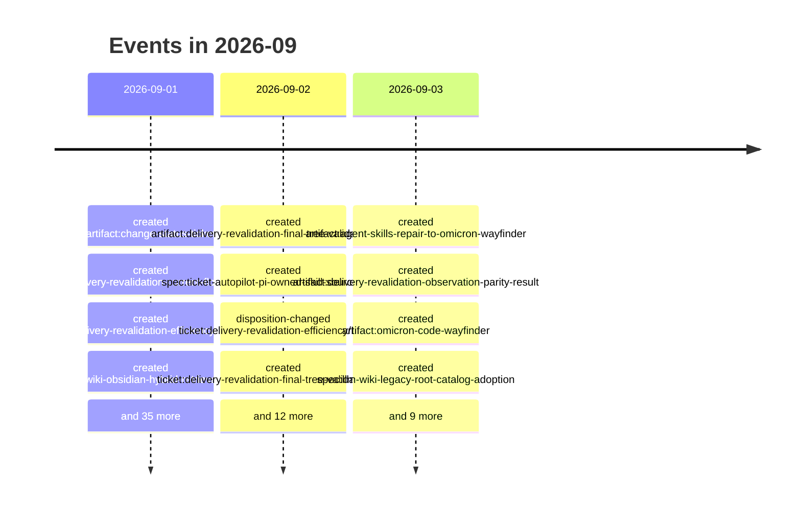

# 2026-09

68 dated event(s). Every date carries the rung that produced it; a date
the resolver could not establish is absent from this page rather than guessed onto it.

## Events

- `2026-09-01` — created of Change Status Ticket (`artifact:change-status-ticket`), from a commit touching the file
- `2026-09-01` — created of Delivery Revalidation Current Flow and Cost (`artifact:delivery-revalidation-current-flow-and-cost`), from a commit touching the file
- `2026-09-01` — created of Delivery Revalidation Efficiency Wayfinder (`artifact:delivery-revalidation-efficiency-wayfinder`), from a commit touching the file
- `2026-09-01` — created of Obsidian-First LLM Wiki with Measured Hybrid Retrieval (`artifact:llm-wiki-obsidian-hybrid-retrieval-wayfinder`), from a commit touching the file
- `2026-09-01` — created of Disposable hybrid-retrieval benchmark over the Obsidian notes (`artifact:llm-wiki-obsidian-retrieval-benchmark`), from a commit touching the file
- `2026-09-01` — created of Obsidian source-to-contract compatibility (`artifact:llm-wiki-obsidian-source-contract-compatibility`), from a commit touching the file
- `2026-09-01` — created of Ticket Autopilot Runner Defect Remediation (`artifact:ticket-autopilot-runner-defect-remediation`), from a commit touching the file
- `2026-09-01` — created of Lifecycle-only status transaction prototype (`path:docs/prototypes/lifecycle-only-status-transaction/NOTES.md`), from a commit touching the file
- `2026-09-01` — created of LLM Wiki Exact-Source Checkout Sync (`spec:llm-wiki-exact-source-checkout-sync`), from a commit touching the file
- `2026-09-01` — created of Add the repository lifecycle transaction and ignored-source slice (`ticket:change-status-ticket/CST-01`), from a commit touching the file
- `2026-09-01` — disposition-changed of Add the repository lifecycle transaction and ignored-source slice (`ticket:change-status-ticket/CST-01`), from a rename recorded in Git
- `2026-09-01` — created of Deliver tracked status candidates through terminal proof (`ticket:change-status-ticket/CST-02`), from a commit touching the file
- `2026-09-01` — disposition-changed of Deliver tracked status candidates through terminal proof (`ticket:change-status-ticket/CST-02`), from a rename recorded in Git
- `2026-09-01` — created of Enforce mutation barriers and safe-boundary projection (`ticket:change-status-ticket/CST-03`), from a commit touching the file
- `2026-09-01` — disposition-changed of Enforce mutation barriers and safe-boundary projection (`ticket:change-status-ticket/CST-03`), from a rename recorded in Git
- `2026-09-01` — created of Publish the dedicated status-change skill and routing contract (`ticket:change-status-ticket/CST-04`), from a commit touching the file
- `2026-09-01` — disposition-changed of Publish the dedicated status-change skill and routing contract (`ticket:change-status-ticket/CST-04`), from a rename recorded in Git
- `2026-09-01` — created of Map the completion-to-delivery revalidation flow (`ticket:delivery-revalidation-efficiency/DRV-01`), from a commit touching the file
- `2026-09-01` — disposition-changed of Map the completion-to-delivery revalidation flow (`ticket:delivery-revalidation-efficiency/DRV-01`), from a rename recorded in Git
- `2026-09-01` — created of Prototype projection-proof options (`ticket:delivery-revalidation-efficiency/DRV-02`), from a commit touching the file
- `2026-09-01` — disposition-changed of Prototype projection-proof options (`ticket:delivery-revalidation-efficiency/DRV-02`), from a rename recorded in Git
- `2026-09-01` — created of Choose the final-tree validation architecture (`ticket:delivery-revalidation-efficiency/DRV-03`), from a commit touching the file
- `2026-09-01` — disposition-changed of Prove a lifecycle-only status transaction (`ticket:lightweight-ticket-status-change/TSC-01`), from a rename recorded in Git
- `2026-09-01` — disposition-changed of Specify the dedicated status-change lane (`ticket:lightweight-ticket-status-change/TSC-02`), from a rename recorded in Git
- `2026-09-01` — created of Preserve hand-written root catalog sections during sync (`ticket:llm-wiki-docs-only-autosync/WS-08`), from a commit touching the file
- `2026-09-01` — created of Discover and synchronize the tracked wiki from the exact source checkout (`ticket:llm-wiki-exact-source-checkout-sync/WXS-01`), from a commit touching the file
- `2026-09-01` — disposition-changed of Discover and synchronize the tracked wiki from the exact source checkout (`ticket:llm-wiki-exact-source-checkout-sync/WXS-01`), from a rename recorded in Git
- `2026-09-01` — created of Research source-to-contract compatibility for the Obsidian notes (`ticket:llm-wiki-obsidian-hybrid-retrieval/OHR-01`), from a commit touching the file
- `2026-09-01` — disposition-changed of Research source-to-contract compatibility for the Obsidian notes (`ticket:llm-wiki-obsidian-hybrid-retrieval/OHR-01`), from a rename recorded in Git
- `2026-09-01` — created of Benchmark disposable hybrid retrieval over the Obsidian notes (`ticket:llm-wiki-obsidian-hybrid-retrieval/OHR-02`), from a commit touching the file
- `2026-09-01` — disposition-changed of Benchmark disposable hybrid retrieval over the Obsidian notes (`ticket:llm-wiki-obsidian-hybrid-retrieval/OHR-02`), from a rename recorded in Git
- `2026-09-01` — disposition-changed of Reconcile an exact single-parent integration copy (`ticket:ticket-autopilot-post-merge-integration-copy-reconciliation/ICR-01`), from a rename recorded in Git
- `2026-09-01` — created of Reset stale delivery preparation after candidate invalidation (`ticket:ticket-autopilot-runner-defect-remediation/RDR-01`), from a commit touching the file
- `2026-09-01` — disposition-changed of Reset stale delivery preparation after candidate invalidation (`ticket:ticket-autopilot-runner-defect-remediation/RDR-01`), from a rename recorded in Git
- `2026-09-01` — created of Prioritize explicit reconciliation over pending merge (`ticket:ticket-autopilot-runner-defect-remediation/RDR-02`), from a commit touching the file
- `2026-09-01` — disposition-changed of Prioritize explicit reconciliation over pending merge (`ticket:ticket-autopilot-runner-defect-remediation/RDR-02`), from a rename recorded in Git
- `2026-09-01` — created of Consume all resolved reconciliation gates (`ticket:ticket-autopilot-runner-defect-remediation/RDR-03`), from a commit touching the file
- `2026-09-01` — created of Make PR-body persistence byte-stable across platforms (`ticket:ticket-autopilot-runner-defect-remediation/RDR-04`), from a commit touching the file
- `2026-09-01` — created of Unify autonomous readiness for precompleted dependencies (`ticket:ticket-autopilot-runner-defect-remediation/RDR-05`), from a commit touching the file
- `2026-09-02` — created of Final-Tree Validation Architecture Decision (`artifact:delivery-revalidation-final-tree-validation-decision`), from a commit touching the file
- `2026-09-02` — created of Migrate the Pi owned-skill source explicitly (`spec:ticket-autopilot-pi-owned-skill-source-migration`), from a commit touching the file
- `2026-09-02` — disposition-changed of Choose the final-tree validation architecture (`ticket:delivery-revalidation-efficiency/DRV-03`), from a rename recorded in Git
- `2026-09-02` — created of Observe Exact Tracked Completion Projections (`ticket:delivery-revalidation-final-tree-validation/FTV-01`), from a commit touching the file
- `2026-09-02` — disposition-changed of Observe Exact Tracked Completion Projections (`ticket:delivery-revalidation-final-tree-validation/FTV-01`), from a rename recorded in Git
- `2026-09-02` — created of Persist and Recover Projected-Not-Integrated Completion (`ticket:delivery-revalidation-final-tree-validation/FTV-02`), from a commit touching the file
- `2026-09-02` — disposition-changed of Persist and Recover Projected-Not-Integrated Completion (`ticket:delivery-revalidation-final-tree-validation/FTV-02`), from a rename recorded in Git
- `2026-09-02` — created of Run One Final Quality Cycle on the Exact Delivery Tree (`ticket:delivery-revalidation-final-tree-validation/FTV-03`), from a commit touching the file
- `2026-09-02` — disposition-changed of Run One Final Quality Cycle on the Exact Delivery Tree (`ticket:delivery-revalidation-final-tree-validation/FTV-03`), from a rename recorded in Git
- `2026-09-02` — created of Prove Observation Parity and Safe Rollback (`ticket:delivery-revalidation-final-tree-validation/FTV-04`), from a commit touching the file
- `2026-09-02` — created of Enable the Bounded Tracked Final-Tree Lane (`ticket:delivery-revalidation-final-tree-validation/FTV-05`), from a commit touching the file
- `2026-09-02` — disposition-changed of Preserve hand-written root catalog sections during sync (`ticket:llm-wiki-docs-only-autosync/WS-08`), from a rename recorded in Git
- `2026-09-02` — created of Migrate an exact owned-skill source (`ticket:ticket-autopilot-pi-owned-skill-source-migration/PSM-01`), from a commit touching the file
- `2026-09-02` — disposition-changed of Consume all resolved reconciliation gates (`ticket:ticket-autopilot-runner-defect-remediation/RDR-03`), from a rename recorded in Git
- `2026-09-02` — disposition-changed of Make PR-body persistence byte-stable across platforms (`ticket:ticket-autopilot-runner-defect-remediation/RDR-04`), from a rename recorded in Git
- `2026-09-02` — disposition-changed of Unify autonomous readiness for precompleted dependencies (`ticket:ticket-autopilot-runner-defect-remediation/RDR-05`), from a rename recorded in Git
- `2026-09-03` — created of Agent Skills repair-to-Omicron work queue (`artifact:agent-skills-repair-to-omicron-wayfinder`), from a commit touching the file
- `2026-09-03` — created of Final-Tree Observation, Parity, and Rollback Evidence (`artifact:delivery-revalidation-observation-parity-result`), from a commit touching the file
- `2026-09-03` — created of Omicron Code (`artifact:omicron-code-wayfinder`), from a commit touching the file
- `2026-09-03` — created of LLM Wiki legacy root-catalog adoption (`spec:llm-wiki-legacy-root-catalog-adoption`), from a commit touching the file
- `2026-09-03` — created of Pi Break Glass natural-language local repair (`spec:pi-break-glass-natural-language-local-repair`), from a commit touching the file
- `2026-09-03` — created of Natural-language repository-wide merge-all intent (`spec:ticket-autopilot-natural-language-merge-all-intent`), from a commit touching the file
- `2026-09-03` — created of Worktree-stable repository authority (`spec:ticket-autopilot-worktree-stable-repository-authority`), from a commit touching the file
- `2026-09-03` — disposition-changed of Prove Observation Parity and Safe Rollback (`ticket:delivery-revalidation-final-tree-validation/FTV-04`), from a rename recorded in Git
- `2026-09-03` — disposition-changed of Enable the Bounded Tracked Final-Tree Lane (`ticket:delivery-revalidation-final-tree-validation/FTV-05`), from a rename recorded in Git
- `2026-09-03` — created of Adopt the Agent Skills legacy root catalog (`ticket:llm-wiki-legacy-root-catalog-adoption/WCA-01`), from a commit touching the file
- `2026-09-03` — disposition-changed of Adopt the Agent Skills legacy root catalog (`ticket:llm-wiki-legacy-root-catalog-adoption/WCA-01`), from a rename recorded in Git
- `2026-09-03` — created of Enable one-turn natural-language local repair (`ticket:pi-break-glass-natural-language-local-repair/BGR-01`), from a commit touching the file
- `2026-09-03` — disposition-changed of Enable one-turn natural-language local repair (`ticket:pi-break-glass-natural-language-local-repair/BGR-01`), from a rename recorded in Git
